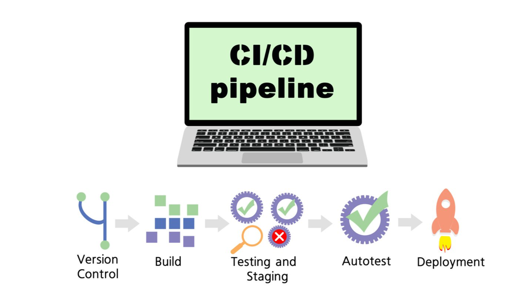

# DevOps
DevOps Concenpts

# DevOps Concepts (Conceitos de DevOps)

## English Version

DevOps is a combination of:

* **Methods:** Refers to the structured approaches and frameworks used in software development and operations.
* **Tools:** Encompasses the various software applications and platforms that automate and facilitate the DevOps processes.
* **Cultural behavior:** Highlights the importance of collaboration, communication, and shared responsibility among development and operations teams.

This integrated approach aims to improve how software is developed and maintained, ultimately helping organizations deliver higher-quality online products faster.

---

## Versão em Português

DevOps é uma combinação de:

* **Métodos:** Refere-se às abordagens estruturadas e frameworks utilizados no desenvolvimento e operações de software.
* **Ferramentas:** Abrange as diversas aplicações e plataformas de software que automatizam e facilitam os processos de DevOps.
* **Comportamento cultural:** Destaca a importância da colaboração, comunicação e responsabilidade compartilhada entre as equipes de desenvolvimento e operações.

Essa abordagem integrada visa melhorar a forma como o software é desenvolvido e mantido, ajudando, em última instância, as organizações a entregar produtos online de maior qualidade mais rapidamente.

# DevOps - True/False Statements (Afirmações Verdadeiras/Falsas)

## English Version

This document summarizes the characteristics of DevOps based on the provided true/false statements.

### True Statements:

* **DevOps helps organize engineering organizations in an improved way.**
    * *Explanation:* DevOps promotes practices that streamline workflows, foster collaboration, and integrate development and operations, leading to more efficient and organized engineering teams.
* **DevOps uses MVPs to increase the pace of innovation.**
    * *Explanation:* Minimum Viable Products (MVPs) are a core concept in agile and DevOps methodologies, allowing teams to quickly validate ideas, gather feedback, and iterate, thereby accelerating the innovation cycle.

### False Statements:

* **DevOps aims to go to the market with a finished product.**
    * *Explanation:* DevOps emphasizes continuous delivery and iterative improvements. The goal is to release frequently and often with smaller, incremental changes, rather than waiting for a "finished" product, which is often a traditional waterfall approach.
* **Traditional change management models suggest an MVP release and product improvements.**
    * *Explanation:* Traditional change management (often associated with waterfall or older methodologies) typically involves extensive planning and large, infrequent releases. The concept of an MVP and continuous, iterative product improvements is characteristic of agile and DevOps methodologies, not traditional models.

---

## Versão em Português

Este documento resume as características de DevOps com base nas afirmações de verdadeiro/falso apresentadas.

### Afirmações Verdadeiras:

* **DevOps ajuda a organizar organizações de engenharia de uma forma melhorada.**
    * *Explicação:* DevOps promove práticas que otimizam fluxos de trabalho, incentivam a colaboração e integram desenvolvimento e operações, resultando em equipes de engenharia mais eficientes e organizadas.
* **DevOps usa MVPs para aumentar o ritmo da inovação.**
    * *Explicação:* Produtos Mínimos Viáveis (MVPs) são um conceito central em metodologias ágeis e DevOps, permitindo que as equipes validem ideias rapidamente, coletem feedback e iterem, acelerando assim o ciclo de inovação.

### Afirmações Falsas:

* **DevOps visa ir para o mercado com um produto acabado.**
    * *Explicação:* DevOps enfatiza a entrega contínua e melhorias iterativas. O objetivo é lançar com frequência e muitas vezes com mudanças menores e incrementais, em vez de esperar por um produto "acabado", que é frequentemente uma abordagem tradicional em cascata (waterfall).
* **Modelos tradicionais de gerenciamento de mudanças sugerem um lançamento de MVP e melhorias de produto.**
    * *Explicação:* O gerenciamento de mudanças tradicional (frequentemente associado a metodologias waterfall ou mais antigas) tipicamente envolve planejamento extenso e lançamentos grandes e infrequentes. O conceito de um MVP e melhorias de produto contínuas e iterativas é característico de metodologias ágeis e DevOps, e não de modelos tradicionais.

# Minimum Viable Product (MVP) - Produto Mínimo Viável

## English Version

### What is an MVP? (As depicted in Release Cycle 1)
* As illustrated, a **Minimum Viable Product (MVP) is an early version of a product with limited functionality.**
* It represents the initial, core iteration released to customers during "Release Cycle 1" to gather essential feedback.
* The focus is on delivering just enough to launch and learn, rather than a fully "finished" product.

### The MVP in the Release Cycle
The image demonstrates how an MVP fits into an iterative development and release flow, often characteristic of DevOps:

* **Requirements & Design:** The cycle begins by defining core requirements and designing the essential functionalities for the MVP.
* **Develop:** The team builds the limited, yet functional, version of the product.
* **Test:** The MVP undergoes testing to ensure its core functionality works as intended.
* **Deploy:** The MVP is released to customers.
* **Review:** After deployment, the team reviews the product's performance and customer engagement.
* **Customers & Feedback:** Crucially, the MVP is put directly in front of customers to elicit immediate reactions and feedback (thumbs up for positive, neutral faces, thumbs down for negative). This feedback loop is vital for subsequent iterations.

### Purpose of Launching an MVP (Connecting to the Cycle)
* **Validate Assumptions:** Quickly test if the limited set of features addresses a real customer need by observing direct customer reactions.
* **Gather Early Feedback:** Obtain real-world insights from users (positive, neutral, negative reactions) immediately after "Launch."
* **Inform Future Iterations:** Use the collected customer feedback to guide subsequent "Design" and "Develop" phases for "Release Cycle 2" and beyond.
* **Reduce Risk:** Avoid extensive development on features that might not resonate with the market, minimizing investment in "Requirements" before validation.

### Key Characteristics of an MVP (Reiterated with Cycle in Mind)
* **Limited Functionality:** Delivers only the absolutely essential features (as part of the first "Develop" cycle).
* **Customer-Centric Feedback:** Designed explicitly to get reactions from "Customers" and drive the "Review" phase.
* **Iterative Base:** Serves as the foundation for future "Develop," "Test," "Deploy" cycles, constantly evolving based on learned insights.
* **Enables Quick Launch:** Facilitates a rapid progression from "Requirements" to "Launch."

### Benefits of This Approach
* **Accelerated Learning:** The direct feedback loop with customers shortens the learning curve significantly.
* **Faster Time to Market:** Enables quick deployment of a viable product, getting value to customers sooner.
* **Risk Mitigation:** Reduces the chance of building a product nobody wants by validating early and often.
* **Continuous Improvement:** The iterative "Develop, Test, Deploy, Review, Design" cycle ensures the product evolves responsively to user needs.

---

## Versão em Português

### O que é um MVP? (Conforme ilustrado no Ciclo de Lançamento 1)
* Conforme ilustrado, um **Produto Mínimo Viável (MVP) é uma versão inicial de um produto com funcionalidade limitada.**
* Ele representa a iteração inicial e central que é lançada para os clientes durante o "Ciclo de Lançamento 1" para coletar feedback essencial.
* O foco é entregar apenas o suficiente para lançar e aprender, em vez de um produto totalmente "acabado".

### O MVP no Ciclo de Lançamento
A imagem demonstra como um MVP se encaixa em um fluxo de desenvolvimento e lançamento iterativo, frequentemente característico do DevOps:

* **Requisitos e Design:** O ciclo começa definindo os requisitos principais e projetando as funcionalidades essenciais para o MVP.
* **Desenvolver (Develop):** A equipe constrói a versão limitada, mas funcional, do produto.
* **Testar (Test):** O MVP passa por testes para garantir que sua funcionalidade principal funcione conforme o esperado.
* **Implantar (Deploy):** O MVP é lançado para os clientes.
* **Revisar (Review):** Após a implantação, a equipe revisa o desempenho do produto e o engajamento do cliente.
* **Clientes e Feedback:** Crucialmente, o MVP é colocado diretamente diante dos clientes para obter reações e feedback imediatos (joinha para positivo, rostos neutros, joinha para baixo para negativo). Este ciclo de feedback é vital para as iterações subsequentes.

### Propósito de Lançar um MVP (Conectando ao Ciclo)
* **Validar Suposições:** Testar rapidamente se o conjunto limitado de funcionalidades aborda uma necessidade real do cliente, observando as reações diretas dos clientes.
* **Coletar Feedback Precoce:** Obter insights do mundo real dos usuários (reações positivas, neutras, negativas) imediatamente após o "Lançamento".
* **Informar Futuras Iterações:** Usar o feedback do cliente coletado para guiar as fases subsequentes de "Design" e "Develop" para o "Ciclo de Lançamento 2" e além.
* **Reduzir Riscos:** Evitar desenvolvimento extensivo em funcionalidades que podem não ressoar com o mercado, minimizando o investimento em "Requisitos" antes da validação.

### Características Chave de um MVP (Reiteradas com o Ciclo em Mente)
* **Funcionalidade Limitada:** Entrega apenas as funcionalidades absolutamente essenciais (como parte do primeiro ciclo de "Desenvolvimento").
* **Feedback Centrado no Cliente:** Projetado explicitamente para obter reações dos "Clientes" e impulsionar a fase de "Revisão".
* **Base Iterativa:** Serve como a base para futuros ciclos de "Desenvolvimento, Teste, Implantação", evoluindo constantemente com base nos aprendizados.
* **Permite Lançamento Rápido:** Facilita uma progressão rápida dos "Requisitos" ao "Lançamento".

### Benefícios Desta Abordagem
* **Aprendizado Acelerado:** O ciclo de feedback direto com os clientes encurta significativamente a curva de aprendizado.
* **Tempo de Lançamento Mais Rápido:** Permite a implantação rápida de um produto viável, entregando valor aos clientes mais cedo.
* **Mitigação de Riscos:** Reduz a chance de construir um produto que ninguém deseja, validando cedo e frequentemente.
* **Melhoria Contínua:** O ciclo iterativo "Desenvolver, Testar, Implantar, Revisar, Design" garante que o produto evolua de forma responsiva às necessidades do usuário.

# Product Improvements through Iterative Release Cycles

This document explains the concept of continuous product improvement driven by customer feedback across iterative release cycles. It highlights how a Minimum Viable Product (MVP) acts as the starting point for this ongoing enhancement process, particularly within a DevOps context.

---

## English Version

### Understanding the Iterative Process: Release Cycle 1 to Release Cycle 2

The image beautifully illustrates a core principle of modern product development and DevOps: **continuous improvement based on validated learning**. It shows how initial product releases (like an MVP) are crucial for gathering real-world feedback that directly influences subsequent development cycles.

#### 1. Release Cycle 1: Launching the Minimum Viable Product (MVP)

* **Requirements & Design:** The journey begins by defining the core problem and designing the essential functionalities for a **Minimum Viable Product (MVP)**.
* **DevOps Loop (Develop, Test, Deploy, Review):** This represents the rapid, iterative cycle where the MVP is built, tested, deployed to users, and its performance is reviewed. This continuous loop is a hallmark of DevOps, aiming for speed and quality.
* **Launch to Customers:** The MVP is launched, directly engaging with real "Customers."
* **Immediate Feedback:** Crucially, customers provide immediate feedback, categorized by their reactions:
    * **Thumbs Up (Positive):** Indicates the MVP is well-received, meeting or exceeding expectations.
    * **Neutral Faces:** Suggests indifference or features that are neither strongly liked nor disliked.
    * **Thumbs Down (Negative):** Highlights dissatisfaction, indicating issues or unmet needs.

#### 2. Driving Product Improvements with Feedback: From Release Cycle 1 to Release Cycle 2

The feedback collected from "Customers" after Release Cycle 1 directly dictates the strategic direction for "Release Cycle 2" and beyond:

* **Scenario A: Positive Feedback (Thumbs Up)**
    * **Action:** The positive reception validates the product's direction.
    * **Outcome:** **"Improve the product"** and **"Invest more resources."** This signifies that the product has found a market fit or delivered significant value, warranting further investment in new features, enhancements, or scaling. The next development cycle focuses on building upon this success.

* **Scenario B: Negative Feedback (Thumbs Down)**
    * **Action:** Negative feedback signals that the MVP did not meet customer expectations or solve their problem effectively.
    * **Outcome:** Two possible paths are indicated:
        * **"Understand the reasons and adapt":** This involves deep analysis of why the product failed (e.g., wrong features, poor usability, unmet need). Based on this understanding, the team can pivot, redesign, or significantly adapt the product's approach for future cycles.
        * **"Drop it without much damage":** If the negative feedback is overwhelming, the core hypothesis is invalidated, or adaptation seems too costly, the team can decide to discontinue the product or feature. This is a crucial benefit of the MVP approach – failing fast and cheaply, minimizing wasted resources.

### Conclusion

This iterative approach, empowered by DevOps principles, ensures that product development is highly responsive to market needs. By continuously launching, gathering feedback, and making data-driven decisions on whether to invest more, adapt, or pivot, organizations can significantly reduce risk and increase their chances of building successful products that truly resonate with customers.

---

## Versão em Português

# Melhorias do Produto Através de Ciclos de Lançamento Iterativos

Este documento explica o conceito de melhoria contínua do produto impulsionada pelo feedback do cliente através de ciclos de lançamento iterativos, Destaca como um Produto Mínimo Viável (MVP) atua como o ponto de partida para este processo contínuo de aprimoramento, especialmente em um contexto DevOps.

---

### Entendendo o Processo Iterativo: Do Ciclo de Lançamento 1 ao Ciclo de Lançamento 2

A imagem ilustra lindamente um princípio central do desenvolvimento moderno de produtos e do DevOps: a **melhoria contínua baseada em aprendizado validado**. Ela mostra como os lançamentos iniciais de produtos (como um MVP) são cruciais para coletar feedback do mundo real que influencia diretamente os ciclos de desenvolvimento subsequentes.

#### 1. Ciclo de Lançamento 1: Lançando o Produto Mínimo Viável (MVP)

* **Requisitos e Design:** A jornada começa definindo o problema central e projetando as funcionalidades essenciais para um **Produto Mínimo Viável (MVP)**.
* **Loop DevOps (Desenvolver, Testar, Implantar, Revisar):** Isso representa o ciclo rápido e iterativo onde o MVP é construído, testado, implantado para os usuários e seu desempenho é revisado. Este loop contínuo é uma marca registrada do DevOps, visando velocidade e qualidade.
* **Lançamento para Clientes:** O MVP é lançado, engajando diretamente com "Clientes" reais.
* **Feedback Imediato:** Crucialmente, os clientes fornecem feedback imediato, categorizado por suas reações:
    * **Joinha para Cima (Positivo):** Indica que o MVP foi bem recebido, atendendo ou superando as expectativas.
    * **Rostos Neutros:** Sugere indiferença ou funcionalidades que não são fortemente gostadas nem desgostadas.
    * **Joinha para Baixo (Negativo):** Destaca insatisfação, indicando problemas ou necessidades não atendidas.

#### 2. Impulsionando as Melhorias do Produto com Feedback: Do Ciclo de Lançamento 1 ao Ciclo de Lançamento 2

O feedback coletado dos "Clientes" após o Ciclo de Lançamento 1 dita diretamente a direção estratégica para o "Ciclo de Lançamento 2" e além:

* **Cenário A: Feedback Positivo (Joinha para Cima)**
    * **Ação:** A recepção positiva valida a direção do produto.
    * **Resultado:** **"Melhorar o produto"** e **"Investir mais recursos."** Isso significa que o produto encontrou um ajuste no mercado ou entregou valor significativo, justificando maior investimento em novas funcionalidades, aprimoramentos ou escalabilidade. O próximo ciclo de desenvolvimento se concentra em construir sobre esse sucesso.

* **Cenário B: Feedback Negativo (Joinha para Baixo)**
    * **Ação:** O feedback negativo indica que o MVP não atendeu às expectativas do cliente ou não resolveu seu problema de forma eficaz.
    * **Resultado:** Dois caminhos possíveis são indicados:
        * **"Entender os motivos e adaptar":** Isso envolve uma análise profunda do motivo pelo qual o produto falhou (por exemplo, funcionalidades erradas, usabilidade ruim, necessidade não atendida). Com base nesse entendimento, a equipe pode pivotar, redesenhar ou adaptar significativamente a abordagem do produto para ciclos futuros.
        * **"Descartar sem muito dano":** Se o feedback negativo for avassalador, a hipótese central for invalidada ou a adaptação parecer muito cara, a equipe pode decidir descontinuar o produto ou a funcionalidade. Este é um benefício crucial da abordagem MVP – falhar rápido e barato, minimizando o desperdício de recursos.

### Conclusão

Essa abordagem iterativa, impulsionada pelos princípios DevOps, garante que o desenvolvimento de produtos seja altamente responsivo às necessidades do mercado. Ao lançar continuamente, coletar feedback e tomar decisões orientadas por dados sobre investir mais, adaptar ou pivotar, as organizações podem reduzir significativamente os riscos e aumentar suas chances de construir produtos de sucesso que realmente ressoam com os clientes.

### Cycle

# Types of Engineering Disciplines (Tipos de Disciplinas de Engenharia)

This document summarizes different engineering disciplines based on the examples provided, showcasing typical tasks associated with each area.

---

## English Version

### 1. Infra Engineering (Engenharia de Infraestrutura)
Focuses on the underlying systems and environments that support applications and services.
* **Cloud Solutions:** Setting up and configuring cloud infrastructure (e.g., AWS, Azure, GCP).
* **Access Management:** Establishing and managing access policies to ensure secure database access only by authorized personnel.

### 2. Product Engineering (Engenharia de Produto)
Concentrates on developing user-facing features and functionalities that constitute a product.
* **Adding Website Functionality:** Implementing features that allow users to directly book hotels via a website.
* **Third-Party Integrations:** Integrating external services (e.g., a car rental agency's webpage) to enable new functionalities within the product.

### 3. Data & ML Engineering (Engenharia de Dados e Machine Learning)
Deals with managing data pipelines, developing machine learning models, and building data-driven intelligent systems.
* **Intelligent Suggestion Systems:** Creating systems that provide personalized suggestions to customers based on their past behavior.
* **Real-time Data Capture:** Capturing and recording user data from a website into a database in real-time for analysis and processing.

---

## Versão em Português

### 1. Infra Engineering (Engenharia de Infraestrutura)
Foca nos sistemas e ambientes subjacentes que dão suporte a aplicações e serviços.
* **Soluções em Nuvem:** Configurar e gerenciar infraestruturas em nuvem (ex: AWS, Azure, GCP).
* **Gerenciamento de Acesso:** Estabelecer e gerenciar políticas de acesso para garantir que apenas pessoal autorizado possa acessar os bancos de dados.

### 2. Product Engineering (Engenharia de Produto)
Concentra-se no desenvolvimento de funcionalidades e recursos voltados para o usuário que compõem um produto.
* **Adicionar Funcionalidades ao Site:** Implementar recursos que permitem aos usuários reservar hotéis diretamente através de um site.
* **Integrações com Terceiros:** Integrar serviços externos (ex: a página de uma agência de aluguel de carros) para habilitar novas funcionalidades dentro do produto.

### 3. Data & ML Engineering (Engenharia de Dados e Machine Learning)
Lida com o gerenciamento de pipelines de dados, desenvolvimento de modelos de machine learning e construção de sistemas inteligentes baseados em dados.
* **Sistemas de Sugestão Inteligentes:** Criar sistemas que fornecem sugestões personalizadas aos clientes com base em seu comportamento passado.
* **Captura de Dados em Tempo Real:** Capturar e registrar dados de usuários de um site em um banco de dados em tempo real para análise e processamento.

# Project Management and DevOps (Gerenciamento de Projetos e DevOps)

This document summarizes the importance of project management within a DevOps context and defines what project management entails.

---

## English Version

### What is Project Management?
Project management is the application of:
* **Specific knowledge:** Expertise in various domains relevant to the project.
* **Skills:** Abilities to lead, communicate, problem-solve, and manage teams.
* **Tools:** Software, frameworks, and methodologies used to plan, execute, and monitor projects.
* **Techniques:** Methods and processes applied to achieve project objectives.

The ultimate goal of project management is to **deliver something of value to people**.

### Why is Project Management Important to DevOps?
Project management plays a crucial role in enabling and enhancing DevOps practices by providing structure and guidance:
* **Defines how the team will operate:** Establishes workflows, roles, responsibilities, and communication channels, ensuring a clear operational model for the team.
* **Drives change:** Facilitates the adoption of new processes, tools, and cultural shifts required for successful DevOps implementation and continuous improvement.
* **Timeline/Resource Management:** Helps in planning and optimizing the allocation of time and resources, ensuring efficient use of personnel, budget, and infrastructure within fast-paced DevOps cycles.
* **Collaboration within/across teams:** Fosters effective communication and synergy between development, operations, and other relevant teams, breaking down silos and promoting shared goals.

---

## Versão em Português

# Gerenciamento de Projetos e DevOps

Este documento resume a importância do gerenciamento de projetos dentro de um contexto DevOps e define o que o gerenciamento de projetos implica.

---

### O que é Gerenciamento de Projetos?
Gerenciamento de projetos é a aplicação de:
* **Conhecimento específico:** Expertise em vários domínios relevantes para o projeto.
* **Habilidades:** Capacidades de liderar, comunicar, resolver problemas e gerenciar equipes.
* **Ferramentas:** Softwares, frameworks e metodologias usadas para planejar, executar e monitorar projetos.
* **Técnicas:** Métodos e processos aplicados para atingir os objetivos do projeto.

O objetivo final do gerenciamento de projetos é **entregar algo de valor às pessoas**.

### Por que o Gerenciamento de Projetos é Importante para DevOps?
O gerenciamento de projetos desempenha um papel crucial ao habilitar e aprimorar as práticas DevOps, fornecendo estrutura e orientação:
* **Define como a equipe irá operar:** Estabelece fluxos de trabalho, papéis, responsabilidades e canais de comunicação, garantindo um modelo operacional claro para a equipe.
* **Impulsiona a mudança:** Facilita a adoção de novos processos, ferramentas e mudanças culturais necessários para uma implementação DevOps bem-sucedida e melhoria contínua.
* **Gerenciamento de Cronogramas/Recursos:** Ajuda no planejamento e otimização da alocação de tempo e recursos, garantindo o uso eficiente de pessoal, orçamento e infraestrutura dentro dos ciclos rápidos de DevOps.
* **Colaboração dentro/entre equipes:** Promove a comunicação eficaz e a sinergia entre as equipes de desenvolvimento, operações e outras equipes relevantes, quebrando silos e promovendo objetivos compartilhados.

# Choosing the Right Project Management Model (Escolhendo o Modelo Certo de Gerenciamento de Projetos)

This document summarizes the key factors to consider when selecting a project management methodology and highlights the prevalent standard in software development.

---

## English Version

### Factors Influencing the Choice of Project Management Methodology

Choosing the most effective project management model is crucial for success and is not a one-size-fits-all decision. The best methodology depends on several critical factors:

* **Team's skill set:** The existing expertise, experience, and familiarity of the team members with different methodologies (e.g., Agile, Waterfall, Scrum, Kanban). A team proficient in agile practices will thrive in such an environment.
* **Budget:** Financial constraints often dictate the feasibility of certain methodologies, as some may require more initial investment in tools, training, or specific roles.
* **Complexity of the project:** Highly complex or rapidly evolving projects often benefit from flexible, iterative approaches, while simpler, well-defined projects might tolerate more traditional models.
* **Expectations:** Stakeholder and client expectations regarding deliverables, timelines, flexibility, and involvement play a significant role in determining the most suitable methodology.

### Agile as the De Facto Standard

For most software development teams today, **Agile is the de facto standard**.
* Agile methodologies (like Scrum and Kanban) emphasize iterative development, flexibility, collaboration, and continuous feedback.
* This approach is particularly well-suited for the dynamic and evolving nature of software projects, allowing teams to adapt to changes quickly and deliver value incrementally.

---

## Versão em Português

# Escolhendo o Modelo Certo de Gerenciamento de Projetos

Este documento resume os fatores chave a serem considerados ao selecionar uma metodologia de gerenciamento de projetos e destaca o padrão predominante no desenvolvimento de software.

---

### Fatores que Influenciam a Escolha da Metodologia de Gerenciamento de Projetos

Escolher o modelo de gerenciamento de projetos mais eficaz é crucial para o sucesso e não é uma decisão única para todas as situações. A melhor metodologia depende de vários fatores críticos:

* **Conjunto de habilidades da equipe:** A expertise, experiência e familiaridade existentes dos membros da equipe com diferentes metodologias (ex: Ágil, Cascata, Scrum, Kanban). Uma equipe proficiente em práticas ágeis prosperará nesse ambiente.
* **Orçamento:** Restrições financeiras frequentemente ditam a viabilidade de certas metodologias, pois algumas podem exigir mais investimento inicial em ferramentas, treinamento ou papéis específicos.
* **Complexidade do projeto:** Projetos altamente complexos ou em rápida evolução geralmente se beneficiam de abordagens flexíveis e iterativas, enquanto projetos mais simples e bem definidos podem tolerar modelos mais tradicionais.
* **Expectativas:** As expectativas das partes interessadas e dos clientes em relação a entregas, prazos, flexibilidade e envolvimento desempenham um papel significativo na determinação da metodologia mais adequada.

### Agile como Padrão de Fato

Para a maioria das equipes de desenvolvimento de software hoje, o **Agile é o padrão de fato**.
* As metodologias ágeis (como Scrum e Kanban) enfatizam o desenvolvimento iterativo, flexibilidade, colaboração e feedback contínuo.
* Essa abordagem é particularmente adequada para a natureza dinâmica e em evolução dos projetos de software, permitindo que as equipes se adaptem às mudanças rapidamente e entreguem valor incrementalmente.

# Project Management Methodologies: True or False (Metodologias de Gerenciamento de Projetos: Verdadeiro ou Falso)

This document explains the validity of various statements regarding popular project management methodologies.

---

## English Version

### True Statements:

1.  **Scrum and Kanban are both great implementations of the Agile philosophy.**
    * **Explanation:** This is **True**. Agile is a mindset defined by values and principles (e.g., from the Agile Manifesto), focusing on iterative development, customer collaboration, and responding to change. Scrum and Kanban are two widely adopted frameworks or methods that operationalize these Agile principles, each with its own practices and strengths.

2.  **Waterfall could be a viable option for small tasks that does not have much complexity.**
    * **Explanation:** This is **True**. While often criticized for its rigidity in complex, evolving projects, the Waterfall model's sequential, linear approach can be perfectly adequate and even efficient for very small, simple, and well-defined tasks or projects where requirements are unlikely to change and risks are minimal.

3.  **Kanban is all about continuous improvement and using visualizations.**
    * **Explanation:** This is **True**. At its core, Kanban focuses on visualizing workflow (e.g., with Kanban boards), limiting Work In Progress (WIP), and continuously improving the flow of value. Its emphasis is on identifying bottlenecks and optimizing the process through incremental changes.

### False Statements:

1.  **Scrum does not define specific roles but ensures collective responsibility.**
    * **Explanation:** This is **False**. Scrum *does* define specific roles: the Product Owner, the Scrum Master, and the Development Team. While Scrum strongly emphasizes collective responsibility for the sprint goal and product outcome, these distinct roles are fundamental to how Scrum teams operate and collaborate.

2.  **Agile is a definitive project management methodology with set practices.**
    * **Explanation:** This is **False**. Agile is not a single, definitive methodology with a rigid set of practices. Instead, Agile is a *philosophy*, a *mindset*, or a *set of principles* (as outlined in the Agile Manifesto). Methodologies like Scrum, Kanban, Lean, Extreme Programming (XP), etc., are specific *frameworks* or *approaches* that implement the Agile philosophy, each with its own defined practices.

---

## Versão em Português

# Metodologias de Gerenciamento de Projetos: Verdadeiro ou Falso

Este documento explica a validade de várias afirmações sobre metodologias populares de gerenciamento de projetos.

---

### Afirmações Verdadeiras:

1.  **Scrum e Kanban são ambas ótimas implementações da filosofia Agile.**
    * **Explicação:** Esta afirmação é **Verdadeira**. Agile é uma mentalidade definida por valores e princípios (ex: do Manifesto Ágil), focando em desenvolvimento iterativo, colaboração com o cliente e resposta a mudanças. Scrum e Kanban são dois frameworks ou métodos amplamente adotados que operacionalizam esses princípios Ágeis, cada um com suas próprias práticas e pontos fortes.

2.  **Waterfall poderia ser uma opção viável para tarefas pequenas que não possuem muita complexidade.**
    * **Explicação:** Esta afirmação é **Verdadeira**. Embora frequentemente criticado por sua rigidez em projetos complexos e em evolução, a abordagem sequencial e linear do modelo Waterfall pode ser perfeitamente adequada e até eficiente para tarefas ou projetos muito pequenos, simples e bem definidos, onde os requisitos são improváveis de mudar e os riscos são mínimos.

3.  **Kanban é sobre melhoria contínua e uso de visualizações.**
    * **Explicação:** Esta afirmação é **Verdadeira**. Em sua essência, o Kanban foca em visualizar o fluxo de trabalho (ex: com quadros Kanban), limitar o Trabalho em Andamento (WIP) e melhorar continuamente o fluxo de valor. Sua ênfase está em identificar gargalos e otimizar o processo por meio de mudanças incrementais.

### Afirmações Falsas:

1.  **Scrum não define papéis específicos, mas garante responsabilidade coletiva.**
    * **Explicação:** Esta afirmação é **Falsa**. O Scrum *define* papéis específicos: o Product Owner (Dono do Produto), o Scrum Master e o Time de Desenvolvimento. Embora o Scrum enfatize fortemente a responsabilidade coletiva pelo objetivo da sprint e pelo resultado do produto, esses papéis distintos são fundamentais para o funcionamento e a colaboração das equipes Scrum.

2.  **Agile é uma metodologia definitiva de gerenciamento de projetos com práticas definidas.**
    * **Explicação:** Esta afirmação é **Falsa**. Agile não é uma metodologia única e definitiva com um conjunto rígido de práticas. Em vez disso, Agile é uma *filosofia*, uma *mentalidade* ou um *conjunto de princípios* (conforme descrito no Manifesto Ágil). Metodologias como Scrum, Kanban, Lean, Extreme Programming (XP), etc., são *frameworks* ou *abordagens* específicas que implementam a filosofia Ágil, cada uma com suas próprias práticas definidas.
  
# Factors in Project Management (Fatores no Gerenciamento de Projetos)

This document outlines some factors that are considered important or unimportant/irrelevant when making decisions in project management.

---

## English Version

When managing projects, understanding which elements truly influence outcomes and which do not is critical. Here are **some factors** categorized by their relevance:

### Important Factors:

These factors significantly impact how a project should be planned, executed, and managed:

* **The complexity of the project:** Highly complex projects often require more flexible methodologies (like Agile), extensive planning, and robust risk management. Simpler projects might allow for more straightforward approaches.
* **The budget of the project:** Financial resources directly dictate the scope, available tools, team size, and even the feasibility of certain approaches. Budget constraints heavily influence decision-making.
* **The size of the team:** Larger teams require more sophisticated communication, coordination, and management structures, while smaller teams might operate more fluidly. Team size impacts resource allocation and methodology choice.

### Unimportant / Irrelevant Factors:

These factors are generally considered not to have a direct or significant impact on the choice of project management approach or the project's success metrics, at least not in the same direct way as the "Important Factors":

* **Using cloud infrastructure:** While *how* infrastructure is used (e.g., specific cloud services, IaC practices) can be part of the project's scope, the mere *fact* of using cloud infrastructure itself does not inherently determine the project management model. It's a technological choice, not a project management influencing factor.
* **The age of the organization:** The number of years an organization has existed typically doesn't directly influence the best project management methodology for a specific project. What matters more are the organization's culture, maturity in adopting new practices, and existing processes, rather than its age.

---

## Versão em Português

# Fatores no Gerenciamento de Projetos

Este documento descreve **alguns fatores** que são considerados importantes ou irrelevantes/sem importância ao tomar decisões no gerenciamento de projetos.

---

### Fatores Importantes:

Esses fatores impactam significativamente como um projeto deve ser planejado, executado e gerenciado:

* **A complexidade do projeto:** Projetos altamente complexos frequentemente exigem metodologias mais flexíveis (como Agile), planejamento extensivo e gerenciamento de riscos robusto. Projetos mais simples podem permitir abordagens mais diretas.
* **O orçamento do projeto:** Os recursos financeiros ditam diretamente o escopo, as ferramentas disponíveis, o tamanho da equipe e até mesmo a viabilidade de certas abordagens. Restrições orçamentárias influenciam fortemente a tomada de decisões.
* **O tamanho da equipe:** Equipes maiores exigem comunicação, coordenação e estruturas de gerenciamento mais sofisticadas, enquanto equipes menores podem operar de forma mais fluida. O tamanho da equipe afeta a alocação de recursos e a escolha da metodologia.

### Fatores Irrelevantes / Sem Importância:

Esses fatores são geralmente considerados como não tendo um impacto direto ou significativo na escolha da abordagem de gerenciamento de projetos ou nas métricas de sucesso do projeto, pelo menos não da mesma forma direta que os "Fatores Importantes":

* **Usando infraestrutura em nuvem:** Embora *como* a infraestrutura é usada (ex: serviços de nuvem específicos, práticas de IaC) possa fazer parte do escopo do projeto, o simples *fato* de usar infraestrutura em nuvem por si só não determina inerentemente o modelo de gerenciamento de projetos. É uma escolha tecnológica, não um fator influenciador do gerenciamento de projetos.
* **A idade da organização:** O número de anos que uma organização existe tipicamente não influencia diretamente a melhor metodologia de gerenciamento de projetos para um projeto específico. O que importa mais são a cultura da organização, a maturidade na adoção de novas práticas e os processos existentes, em vez de sua idade.

# Product Development and Release Cycle (Ciclo de Desenvolvimento e Lançamento de Produto)

This document outlines the sequential steps typically involved in developing and releasing a software product, from initial definition to full public availability, based on the provided items.

---

## English Version

The process of bringing a software product to life involves several key stages, each building upon the previous one. Here are the steps in their correct logical order:

### The Correct Order of Product Development and Release Steps:

1.  **Defining the deliverables and goals related to the product, the software components, their functionality and relation to each other.**
    * **Explanation:** This is the foundational phase. Before any coding begins, it's crucial to clearly define *what* the product will do, *what value* it will deliver, its main objectives, and how its various software parts will interact. This sets the blueprint for the entire project.

2.  **Writing the code for the software components of the product.**
    * **Explanation:** Once the definitions and designs are in place, the development team proceeds with the actual coding. This involves translating the requirements and architectural designs into functional software components.

3.  **Check if the product functions as planned.**
    * **Explanation:** After development, rigorous testing is performed. This step verifies that the software components work correctly, meet the defined requirements, and are free of bugs. Quality assurance is paramount here.

4.  **Review the product one last time before the launch.**
    * **Explanation:** Before any public release, a final comprehensive review is conducted. This involves stakeholders, product owners, and key team members performing a last check to ensure everything is aligned with goals, quality standards, and is ready for users.

5.  **Release the product for a limited set of users.**
    * **Explanation:** This step often represents a Beta release, a controlled rollout, or the launch of a Minimum Viable Product (MVP). The product is made available to a small, specific group of users to gather real-world feedback, identify unforeseen issues, and validate assumptions in a live environment before a broader release.

6.  **Release the product for all of the users.**
    * **Explanation:** Once the product has been validated by the limited user group, necessary adjustments have been made, and confidence in its stability and value is high, it is then fully released to the entire target user base. This is the official public launch.

---

## Versão em Português

# Ciclo de Desenvolvimento e Lançamento de Produto

Este documento descreve os passos sequenciais tipicamente envolvidos no desenvolvimento e lançamento de um produto de software, desde a definição inicial até a disponibilidade pública total, com base nos itens fornecidos.

---

## A Ordem Correta dos Passos de Desenvolvimento e Lançamento de Produto:

1.  **Definir as entregas e metas relacionadas ao produto, os componentes de software, suas funcionalidades e a relação entre eles.**
    * **Explicação:** Esta é a fase fundamental. Antes de qualquer codificação, é crucial definir claramente *o que* o produto fará, *qual valor* ele entregará, seus objetivos principais e como suas várias partes de software interagirão. Isso estabelece o plano para todo o projeto.

2.  **Escrever o código para os componentes de software do produto.**
    * **Explicação:** Uma vez que as definições e designs estejam prontos, a equipe de desenvolvimento prossegue com a codificação real. Isso envolve traduzir os requisitos e designs arquitetônicos em componentes de software funcionais.

3.  **Verificar se o produto funciona conforme o planejado.**
    * **Explicação:** Após o desenvolvimento, testes rigorosos são realizados. Este passo verifica se os componentes de software funcionam corretamente, atendem aos requisitos definidos e estão livres de bugs. A garantia de qualidade é primordial aqui.

4.  **Rever o produto uma última vez antes do lançamento.**
    * **Explicação:** Antes de qualquer lançamento público, uma revisão final abrangente é realizada. Isso envolve stakeholders, donos de produto e membros chave da equipe fazendo uma última verificação para garantir que tudo esteja alinhado com os objetivos, padrões de qualidade e esteja pronto para os usuários.

5.  **Lançar o produto para um conjunto limitado de usuários.**
    * **Explicação:** Este passo frequentemente representa um lançamento Beta, um lançamento controlado ou o lançamento de um Produto Mínimo Viável (MVP). O produto é disponibilizado para um pequeno grupo específico de usuários para coletar feedback do mundo real, identificar problemas imprevistos e validar suposições em um ambiente real antes de um lançamento mais amplo.

6.  **Lançar o produto para todos os usuários.**
    * **Explicação:** Uma vez que o produto foi validado pelo grupo limitado de usuários, os ajustes necessários foram feitos e a confiança em sua estabilidade e valor é alta, ele é então totalmente lançado para toda a base de usuários-alvo. Este é o lançamento público oficial.
  
# Product Development Phases: Design, Development, and Testing

This document outlines key activities within three fundamental phases of product development: Design, Development, and Testing.

---

## English Version

Product development is an iterative process that typically moves through distinct phases, each with specific objectives to ensure a robust and functional outcome.

### 1. Design
This phase focuses on the strategic planning and architectural blueprint of the system, particularly concerning data management.
* **Key Activity:** Working with the product engineering teams to plan how data should flow between systems.
    * **Explanation:** This involves defining data structures, integration points, APIs, and overall data architecture to ensure seamless and efficient communication and transfer of information across different components and systems within the product ecosystem. It's about laying the groundwork before implementation.

### 2. Development
This phase is where the planned designs are translated into functional code and infrastructure.
* **Key Activity:** Implement the data pipelines that allows the data flow between systems.
    * **Explanation:** Based on the design specifications, engineers build and configure the actual mechanisms (e.g., ETL processes, message queues, APIs, databases) that enable data to move, transform, and be stored as intended. This is the creation of the working components.

### 3. Testing
This crucial phase ensures that the developed product functions correctly and meets its intended specifications.
* **Key Activity:** Provide mock data to the product to see if it behaves as planned.
    * **Explanation:** Testers and developers use simulated or dummy data to rigorously evaluate the product's functionality, performance, and reliability. This helps identify bugs, validate data flows, and confirm that the system behaves as expected under various conditions before it's exposed to real user data or production environments.

---

## Versão em Português

# Fases do Desenvolvimento de Produto: Design, Desenvolvimento e Teste

Este documento descreve as atividades chave dentro de três fases fundamentais do desenvolvimento de produto: Design, Desenvolvimento e Teste.

---

## Versão em Português

O desenvolvimento de produtos é um processo iterativo que tipicamente passa por fases distintas, cada uma com objetivos específicos para garantir um resultado robusto e funcional.

### 1. Design
Esta fase foca no planejamento estratégico e no projeto arquitetural do sistema, particularmente no que diz respeito à gestão de dados.
* **Atividade Chave:** Trabalhar com as equipes de engenharia de produto para planejar como os dados devem fluir entre os sistemas.
    * **Explicação:** Isso envolve a definição de estruturas de dados, pontos de integração, APIs e a arquitetura geral de dados para garantir comunicação e transferência de informações contínuas e eficientes entre diferentes componentes e sistemas dentro do ecossistema do produto. É sobre estabelecer as bases antes da implementação.

### 2. Desenvolvimento
Esta fase é onde os designs planejados são traduzidos em código funcional e infraestrutura.
* **Atividade Chave:** Implementar os pipelines de dados que permitem o fluxo de dados entre os sistemas.
    * **Explicação:** Com base nas especificações de design, os engenheiros constroem e configuram os mecanismos reais (ex: processos ETL, filas de mensagens, APIs, bancos de dados) que permitem que os dados se movam, transformem e sejam armazenados conforme o planejado. Esta é a criação dos componentes em funcionamento.

### 3. Teste
Esta fase crucial garante que o produto desenvolvido funcione corretamente e atenda às suas especificações pretendidas.
* **Atividade Chave:** Fornecer dados simulados (mock data) ao produto para ver se ele se comporta conforme o planejado.
    * **Explicação:** Testadores e desenvolvedores usam dados simulados ou fictícios para avaliar rigorosamente a funcionalidade, desempenho e confiabilidade do produto. Isso ajuda a identificar bugs, validar fluxos de dados e confirmar que o sistema se comporta como esperado sob várias condições antes de ser exposto a dados de usuários reais ou ambientes de produção.
 
# Software Architecture Concepts (Conceitos de Arquitetura de Software)

This document provides a concise overview of software architecture, factors influencing architectural decisions, and the role of Application Programming Interfaces (APIs).

---

## English Version

### 1. Software Architecture

**Software architecture refers to the fundamental structures of a software system and the discipline of creating such structures and systems.**
* Each structure comprises software elements, relations among them, and properties of both elements and relations.
    * *Explanation:* This defines the high-level organization of a software system, including its main components, how they interact, and the principles guiding its design and evolution. It's the blueprint for the entire system.

### 2. Various Architectural Systems: Factors to Consider

When designing or evaluating a software architecture, several factors need to be considered to ensure the system is robust, scalable, and meets its requirements:

* **Type of software:** Different software types (e.g., desktop applications, web applications, mobile apps, embedded systems) have distinct architectural needs.
* **In machine or in the browser:** This refers to the deployment environment. Software running directly on a machine (desktop app, server-side) has different architectural considerations than software running within a web browser (front-end web app).
* **Complexity of the software:** The inherent intricacy of the software greatly influences architectural choices. More complex systems typically require more sophisticated architectural patterns.
* **Simpler software parts can be treated as a single unit:** For less complex components or modules, a monolithic approach or treating them as a single, cohesive unit might be efficient.
* **Separate the pieces for more complex software:** For highly complex systems, breaking them down into smaller, independent, and manageable components (e.g., microservices) is often a preferred architectural strategy to reduce complexity and improve maintainability.

### 3. Application Programming Interfaces (APIs)

APIs are fundamental connectors in modern software architecture, enabling different software components or systems to communicate.

* **Data flows through APIs.**
    * *Explanation:* APIs act as intermediaries that define how software components should interact. They specify the methods and data formats that applications can use to request and exchange information, essentially creating a pathway for data to flow between disparate systems.
* **They are essential for software and architecture.**
    * *Explanation:* APIs are crucial for building interconnected and scalable systems. They promote modularity, reusability, and interoperability, allowing developers to build complex applications by integrating various services without needing to understand their internal workings.

---

## Versão em Português

# Conceitos de Arquitetura de Software

Este documento fornece uma visão geral concisa da arquitetura de software, fatores que influenciam as decisões arquiteturais e o papel das Interfaces de Programação de Aplicações (APIs).

---

## Versão em Português

### 1. Arquitetura de Software

**Arquitetura de software refere-se às estruturas fundamentais de um sistema de software e à disciplina de criação de tais estruturas e sistemas.**
* Cada estrutura compreende elementos de software, relações entre eles e propriedades tanto dos elementos quanto das relações.
    * *Explicação:* Isso define a organização de alto nível de um sistema de software, incluindo seus principais componentes, como eles interagem e os princípios que guiam seu design e evolução. É o projeto para todo o sistema.

### 2. Diversos Sistemas Arquiteturais: Fatores a Considerar

Ao projetar ou avaliar uma arquitetura de software, vários fatores precisam ser considerados para garantir que o sistema seja robusto, escalável e atenda aos seus requisitos:

* **Tipo de software:** Diferentes tipos de software (ex: aplicações de desktop, aplicações web, aplicativos móveis, sistemas embarcados) possuem necessidades arquiteturais distintas.
* **Na máquina ou no navegador:** Isso se refere ao ambiente de implantação. Software rodando diretamente em uma máquina (aplicativo de desktop, lado do servidor) tem considerações arquiteturais diferentes do software rodando em um navegador web (aplicativo web front-end).
* **Complexidade do software:** A complexidade inerente do software influencia muito as escolhas arquiteturais. Sistemas mais complexos tipicamente exigem padrões arquiteturais mais sofisticados.
* **Partes de software mais simples podem ser tratadas como uma única unidade:** Para componentes ou módulos menos complexos, uma abordagem monolítica ou tratá-los como uma unidade única e coesa pode ser eficiente.
* **Separar as peças para software mais complexo:** Para sistemas altamente complexos, dividi-los em componentes menores, independentes e gerenciáveis (ex: microsserviços) é frequentemente uma estratégia arquitetural preferida para reduzir a complexidade e melhorar a manutenibilidade.

### 3. Interfaces de Programação de Aplicações (APIs)

APIs são conectores fundamentais na arquitetura de software moderna, permitindo que diferentes componentes ou sistemas de software se comuniquem.

* **Fluxo de dados através de APIs.**
    * *Explicação:* As APIs atuam como intermediários que definem como os componentes de software devem interagir. Elas especificam os métodos e formatos de dados que as aplicações podem usar para solicitar e trocar informações, essencialmente criando um caminho para que os dados fluam entre sistemas díspares.
* **São essenciais para software e arquitetura.**
    * *Explicação:* As APIs são cruciais para a construção de sistemas interconectados e escaláveis. Elas promovem modularidade, reusabilidade e interoperabilidade, permitindo que os desenvolvedores construam aplicações complexas integrando vários serviços sem a necessidade de entender seu funcionamento interno.

# Microservices and DevOps Architecture (Microsserviços e Arquitetura DevOps)

This document explains what microservices are, their key characteristics, and how the DevOps methodology is applied to their development and deployment.

---

## English Version

### 1. Microservices

Microservices represent a modern architectural approach, especially relevant for complex software systems.

* **Most important architectural system for complex software.**
    * *Explanation:* This approach is highly favored for large, intricate applications because it allows for greater modularity, scalability, and flexibility compared to traditional monolithic architectures.
* **Common in modern organizations.**
    * *Explanation:* Many contemporary companies, particularly those focused on rapid innovation and continuous delivery, have adopted microservices due to their inherent advantages in agility and resilience.
* **Rather than a big single unit, have many smaller independent units.**
    * *Explanation:* This is the defining characteristic. Instead of building one large, tightly coupled application, a microservices architecture breaks down the application into a collection of small, autonomous services.
* **Smaller units are called the microservices.**
    * *Explanation:* Each of these independent, small units is a "microservice," typically responsible for a specific business capability.
* **They communicate to each other via APIs.**
    * *Explanation:* Since microservices are independent, they rely on well-defined Application Programming Interfaces (APIs) to interact and exchange data, ensuring loose coupling and clear contracts between services.

### 2. DevOps for Microservices Architecture

DevOps principles are intrinsically linked with the successful implementation and management of microservices, facilitating their iterative development and deployment.

The image illustrates how individual microservices, like "Microservice: Hotels" or "Microservice: Rental Cars," evolve through a continuous DevOps cycle:

* **Iterative Development:** Each microservice can be developed, tested, and deployed independently. For instance, "Microservice: Hotels v1" can be updated to "Microservice: Hotels v2" without affecting other services like "Microservice: Rental Cars v1."
* **DevOps Cycle:** Changes to a microservice go through a full **DevOps** cycle, which includes:
    * **Develop:** Coding and building the service.
    * **Test:** Verifying the service's functionality and performance.
    * **Deploy:** Releasing the updated service to an environment.
    * **Review:** Evaluating the service's performance and impact.
    * **Design:** Planning future enhancements or adaptations based on feedback and new requirements.
* **Requirements and Launch:** This cycle is driven by new "Requirement" and culminates in a "Launch," allowing for rapid iteration and deployment of updates to specific services without needing to re-release the entire application.

This synergy between DevOps and microservices allows organizations to achieve faster release cycles, greater operational efficiency, and more resilient systems by managing smaller, more manageable units.

---

## Versão em Português

# Microsserviços e Arquitetura DevOps

Este documento explica o que são microsserviços, suas características chave e como a metodologia DevOps é aplicada ao seu desenvolvimento e implantação.

---

## Versão em Português

### 1. Microsserviços

Microsserviços representam uma abordagem arquitetural moderna, especialmente relevante para sistemas de software complexos.

* **Sistema arquitetural mais importante para software complexo.**
    * *Explicação:* Essa abordagem é altamente favorecida para aplicações grandes e intrincadas porque permite maior modularidade, escalabilidade e flexibilidade em comparação com as arquiteturas monolíticas tradicionais.
* **Comum em organizações modernas.**
    * *Explicação:* Muitas empresas contemporâneas, particularmente aquelas focadas em inovação rápida e entrega contínua, adotaram microsserviços devido às suas vantagens inerentes em agilidade e resiliência.
* **Em vez de uma grande unidade única, possui muitas unidades menores independentes.**
    * *Explicação:* Esta é a característica definidora. Em vez de construir uma única aplicação grande e fortemente acoplada, uma arquitetura de microsserviços divide a aplicação em uma coleção de serviços pequenos e autônomos.
* **Unidades menores são chamadas de microsserviços.**
    * *Explicação:* Cada uma dessas unidades pequenas e independentes é um "microsserviço", tipicamente responsável por uma capacidade de negócio específica.
* **Eles se comunicam entre si via APIs.**
    * *Explicação:* Como os microsserviços são independentes, eles dependem de Interfaces de Programação de Aplicações (APIs) bem definidas para interagir e trocar dados, garantindo acoplamento frouxo e contratos claros entre os serviços.

### 2. DevOps para Arquitetura de Microsserviços

Os princípios DevOps estão intrinsecamente ligados à implementação e gerenciamento bem-sucedidos de microsserviços, facilitando seu desenvolvimento e implantação iterativos.

A imagem ilustra como microsserviços individuais, como "Microsserviço: Hotéis" ou "Microsserviço: Aluguel de Carros", evoluem através de um ciclo DevOps contínuo:

* **Desenvolvimento Iterativo:** Cada microsserviço pode ser desenvolvido, testado e implantado de forma independente. Por exemplo, "Microsserviço: Hotéis v1" pode ser atualizado para "Microsserviço: Hotéis v2" sem afetar outros serviços como "Microsserviço: Aluguel de Carros v1".
* **Ciclo DevOps:** As mudanças em um microsserviço passam por um ciclo **DevOps** completo, que inclui:
    * **Desenvolver (Develop):** Codificação e construção do serviço.
    * **Testar (Test):** Verificação da funcionalidade e desempenho do serviço.
    * **Implantar (Deploy):** Lançamento do serviço atualizado para um ambiente.
    * **Revisar (Review):** Avaliação do desempenho e impacto do serviço.
    * **Design:** Planejamento de futuras melhorias ou adaptações com base em feedback e novos requisitos.
* **Requisitos e Lançamento:** Este ciclo é impulsionado por um novo "Requisito" e culmina em um "Lançamento", permitindo iteração rápida e implantação de atualizações para serviços específicos sem a necessidade de relançar a aplicação inteira.

Essa sinergia entre DevOps e microsserviços permite que as organizações alcancem ciclos de lançamento mais rápidos, maior eficiência operacional e sistemas mais resilientes, gerenciando unidades menores e mais gerenciáveis.

# Benefits of DevOps for Microservices (Benefícios do DevOps para Microsserviços)

This document outlines the key advantages of adopting DevOps practices in conjunction with a microservices architecture, as presented in the image. This combination significantly enhances an organization's ability to develop, deploy, and operate software efficiently and reliably.

---

## English Version

### Key Benefits of DevOps for Microservices

The synergy between DevOps principles and microservices architecture brings forth several significant benefits, particularly for large and dynamic organizations:

* **Software is changed constantly in large organizations.**
    * **Explanation:** In complex enterprise environments, software is not static. DevOps, combined with microservices, embraces this reality by enabling frequent, small, and continuous changes, allowing organizations to adapt rapidly to market demands and user feedback.

* **Change them one at a time.**
    * **Explanation:** One of the most powerful benefits of microservices is their independence. This architectural style allows individual services to be developed, tested, and deployed in isolation. DevOps pipelines automate this process, meaning that updates or bug fixes to one microservice can be rolled out without affecting or requiring a redeployment of the entire application.

* **Microservices are more secure and reliable.**
    * **Explanation:** Due to their smaller size and focused functionality, microservices can often be made more secure as their attack surface is reduced. Reliability is enhanced because issues are isolated; a failure in one service typically does not bring down the entire system, leading to greater overall resilience.

* **If anything goes bad with one microservice, the rest will still function well.**
    * **Explanation:** This directly relates to the concept of fault isolation inherent in microservices. If a bug, crash, or performance issue occurs in a single microservice, the impact is localized. Other services, operating independently, continue to function normally, maintaining the overall availability and functionality of the application, which is a critical aspect of reliability.

---

## Versão em Português

# Benefícios do DevOps para Microsserviços

Este documento descreve as principais vantagens de adotar práticas DevOps em conjunto com uma arquitetura de microsserviços, conforme apresentado na imagem. Essa combinação aprimora significativamente a capacidade de uma organização de desenvolver, implantar e operar software de forma eficiente e confiável.

---

## Versão em Português

### Principais Benefícios do DevOps para Microsserviços

A sinergia entre os princípios DevOps e a arquitetura de microsserviços traz vários benefícios significativos, particularmente para organizações grandes e dinâmicas:

* **Software é alterado constantemente em grandes organizações.**
    * **Explicação:** Em ambientes empresariais complexos, o software não é estático. O DevOps, combinado com microsserviços, abraça essa realidade, permitindo mudanças frequentes, pequenas e contínuas, o que permite às organizações se adaptarem rapidamente às demandas do mercado e ao feedback dos usuários.

* **Altere-os um de cada vez.**
    * **Explicação:** Um dos benefícios mais poderosos dos microsserviços é sua independência. Esse estilo arquitetural permite que serviços individuais sejam desenvolvidos, testados e implantados isoladamente. Os pipelines DevOps automatizam esse processo, o que significa que atualizações ou correções de bugs em um microsserviço podem ser lançadas sem afetar ou exigir uma reimplementação de toda a aplicação.

* **Microsserviços são mais seguros e confiáveis.**
    * **Explicação:** Devido ao seu tamanho menor e funcionalidade focada, os microsserviços podem ser tornados mais seguros, pois sua superfície de ataque é reduzida. A confiabilidade é aprimorada porque os problemas são isolados; uma falha em um serviço geralmente não derruba todo o sistema, levando a uma maior resiliência geral.

* **Se algo der errado com um microsserviço, o restante ainda funcionará bem.**
    * **Explicação:** Isso se relaciona diretamente com o conceito de isolamento de falhas inerente aos microsserviços. Se um bug, falha ou problema de desempenho ocorrer em um único microsserviço, o impacto é localizado. Outros serviços, operando independentemente, continuam a funcionar normalmente, mantendo a disponibilidade e a funcionalidade geral da aplicação, o que é um aspecto crítico da confiabilidade.

# Architectural Decisions: Relevant vs. Irrelevant Factors (Decisões Arquiteturais: Fatores Relevantes vs. Irrelevantes)

This document outlines key factors that are considered relevant or irrelevant when making decisions about software architecture, based on the provided image. Understanding these distinctions helps in building robust and effective systems.

---

## English Version

When designing software architecture, it's crucial to distinguish between factors that significantly influence the architectural choices and those that do not.

### Relevant Factors (for Software Architecture):

These factors have a direct and substantial impact on how a software system should be structured and designed:

* **The complexity of the software:**
    * **Explanation:** The inherent intricacy of the software system (e.g., number of features, interdependencies, business rules) is a primary driver for architectural decisions. More complex software often necessitates distributed, modular architectures (like microservices) to manage complexity.
* **Size of the team:**
    * **Explanation:** The number of people involved in developing and maintaining the software can influence architectural choices. Smaller teams might lean towards simpler architectures, while larger, distributed teams might benefit from architectures that promote independent work and clear boundaries between components.
* **The platform that the software is interacting with the users: mobile or web.**
    * **Explanation:** The target user interface platform (e.g., native mobile applications, web browsers, desktop applications) profoundly impacts architectural decisions, including front-end frameworks, API design, performance considerations, and deployment strategies.

### Irrelevant Factors (for Software Architecture):

These factors are generally considered to have little to no direct impact on the fundamental architectural design of the software itself:

* **The technology used for the data pipelines:**
    * **Explanation:** While data pipelines are a part of the overall system, the *specific technology* chosen for them (e.g., Kafka, Apache Flink, custom scripts) is typically an implementation detail within a chosen architectural pattern, rather than a driver for the overall architecture. The *need* for data pipelines is relevant, but the specific tool is less so for the high-level architecture.
* **The geolocation of software users:**
    * **Explanation:** The geographical location of users is typically more relevant for deployment strategies (e.g., content delivery networks, regional data centers for latency), compliance, or data sovereignty, rather than determining the fundamental software architecture itself.
* **The sector of the organization:**
    * **Explanation:** The industry sector (e.g., finance, healthcare, e-commerce) an organization operates in does not directly dictate the core software architecture. While industry-specific compliance or security requirements might influence certain architectural decisions, the sector itself isn't a primary architectural driver. The *nature* of the software's problems within that sector is what matters.

---

## Versão em Português

# Decisões Arquiteturais: Fatores Relevantes vs. Irrelevantes

Este documento descreve os fatores chave que são considerados relevantes ou irrelevantes ao tomar decisões sobre arquitetura de software, com base na imagem fornecida. Compreender essas distinções ajuda na construção de sistemas robustos e eficazes.

---

## Versão em Português

Ao projetar a arquitetura de software, é crucial distinguir entre fatores que influenciam significativamente as escolhas arquiteturais e aqueles que não o fazem.

### Fatores Relevantes (para Arquitetura de Software):

Esses fatores têm um impacto direto e substancial na forma como um sistema de software deve ser estruturado e projetado:

* **A complexidade do software:**
    * **Explicação:** A complexidade inerente do sistema de software (ex: número de funcionalidades, interdependências, regras de negócio) é um dos principais impulsionadores das decisões arquiteturais. Softwares mais complexos frequentemente necessitam de arquiteturas distribuídas e modulares (como microsserviços) para gerenciar essa complexidade.
* **Tamanho da equipe:**
    * **Explicação:** O número de pessoas envolvidas no desenvolvimento e manutenção do software pode influenciar as escolhas arquiteturais. Equipes menores podem tender a arquiteturas mais simples, enquanto equipes maiores e distribuídas podem se beneficiar de arquiteturas que promovem trabalho independente e limites claros entre os componentes.
* **A plataforma com a qual o software está interagindo com os usuários: mobile ou web.**
    * **Explicação:** A plataforma de interface do usuário alvo (ex: aplicativos móveis nativos, navegadores web, aplicativos de desktop) impacta profundamente as decisões arquiteturais, incluindo frameworks de front-end, design de API, considerações de desempenho e estratégias de implantação.

### Fatores Irrelevantes (para Arquitetura de Software):

Esses fatores são geralmente considerados como tendo pouco ou nenhum impacto direto no design arquitetural fundamental do software em si:

* **A tecnologia usada para os pipelines de dados:**
    * **Explicação:** Embora os pipelines de dados sejam parte do sistema geral, a *tecnologia específica* escolhida para eles (ex: Kafka, Apache Flink, scripts personalizados) é tipicamente um detalhe de implementação dentro de um padrão arquitetural escolhido, e não um impulsionador para a arquitetura geral. A *necessidade* de pipelines de dados é relevante, mas a ferramenta específica é menos importante para a arquitetura de alto nível.
* **A geolocalização dos usuários de software:**
    * **Explicação:** A localização geográfica dos usuários é geralmente mais relevante para estratégias de implantação (ex: redes de entrega de conteúdo, centros de dados regionais para latência), conformidade ou soberania de dados, em vez de determinar a arquitetura fundamental do software em si.
* **O setor da organização:**
    * **Explicação:** O setor industrial (ex: finanças, saúde, e-commerce) em que uma organização opera não dita diretamente a arquitetura central do software. Embora requisitos de conformidade ou segurança específicos do setor possam influenciar certas decisões arquiteturais, o setor em si não é um impulsionador arquitetural primário. A *natureza* dos problemas do software dentro desse setor é o que importa.
 

# Main Components of IT Infrastructure (Principais Componentes da Infraestrutura de TI)

This document outlines the fundamental building blocks of IT infrastructure, emphasizing its composite nature and customization.

---

## English Version

IT infrastructure forms the backbone of any organization's technological operations, enabling various functions and services.

* **Combination of various components.**
    * **Explanation:** IT infrastructure is not a single entity but a complex ecosystem formed by the integration of diverse elements that work together to support business processes.
* **Customized for organizations specific needs.**
    * **Explanation:** A robust IT infrastructure is designed and tailored to meet the unique requirements, goals, and scale of a particular organization, ensuring optimal performance and efficiency for its specific operations.

### Core Components:

The image highlights three primary categories that constitute the main components of IT infrastructure:

1.  **Software** (`</>` icon)
    * **Explanation:** This includes all the applications, operating systems, databases, and other programs that run on the hardware and manage the network. It's the set of instructions that tells the hardware what to do.

2.  **Network** (`🌐` icon)
    * **Explanation:** This refers to the interconnected system that allows different components (hardware and software) to communicate with each other and with the outside world. It includes routers, switches, cables, wireless access points, and network protocols.

3.  **Hardware** (`[:::]` server rack icon)
    * **Explanation:** This encompasses all the physical components of the IT system. This includes servers, computers, storage devices (e.g., hard drives, SSDs), and other physical equipment necessary for data processing and storage.

---

## Versão em Português

# Principais Componentes da Infraestrutura de TI

Este documento descreve os blocos de construção fundamentais da infraestrutura de TI, enfatizando sua natureza composta e personalização.

---

## Versão em Português

A infraestrutura de TI forma a espinha dorsal das operações tecnológicas de qualquer organização, habilitando diversas funções e serviços.

* **Combinação de vários componentes.**
    * **Explicação:** A infraestrutura de TI não é uma entidade única, mas um ecossistema complexo formado pela integração de diversos elementos que trabalham juntos para suportar os processos de negócio.
* **Personalizada para as necessidades específicas das organizações.**
    * **Explicação:** Uma infraestrutura de TI robusta é projetada e adaptada para atender aos requisitos, objetivos e escala exclusivos de uma organização específica, garantindo desempenho e eficiência ótimos para suas operações particulares.

### Componentes Essenciais:

A imagem destaca três categorias primárias que constituem os principais componentes da infraestrutura de TI:

1.  **Software** (`</>` ícone)
    * **Explicação:** Isso inclui todas as aplicações, sistemas operacionais, bancos de dados e outros programas que rodam no hardware e gerenciam a rede. É o conjunto de instruções que diz ao hardware o que fazer.

2.  **Rede** (`🌐` ícone)
    * **Explicação:** Refere-se ao sistema interconectado que permite que diferentes componentes (hardware e software) se comuniquem entre si e com o mundo exterior. Inclui roteadores, switches, cabos, pontos de acesso sem fio e protocolos de rede.

3.  **Hardware** (`[:::]` ícone de rack de servidor)
    * **Explicação:** Abrange todos os componentes físicos do sistema de TI. Isso inclui servidores, computadores, dispositivos de armazenamento (ex: discos rígidos, SSDs) e outros equipamentos físicos necessários para o processamento e armazenamento de dados.
  

# From Development to Deployment: A Platform Engineering Flow

This document describes a typical flow for software changes, illustrating how a developer's modifications move through various stages, including version control, automated processes, and ultimately reach the customer via a deployment platform.

---

## English Version

### The Software Delivery Pipeline

The process of updating or creating new features in a software product generally follows a structured pipeline designed for efficiency, security, and continuous delivery. This pipeline connects the initial developer activity to the final user experience.

1.  **Developer Platform: Initiating Change**
    * **Developer changes part of the codebase.**
        * **Explanation:** This is where the development process begins. A developer uses their platform (like an Integrated Development Environment - IDE, or a local coding environment) to write, modify, or extend the existing source code of a software product. These changes might include new features, bug fixes, or performance enhancements.

2.  **Codebase & Version Control: Securing and Integrating Code**
    * **Code is merged to the rest of the codebase securely.**
        * **Explanation:** Once the developer's changes are complete and locally validated, they are submitted to a version control system (such as Git). This system facilitates the merging of the new code with the main codebase, ensuring proper tracking, collaboration, and conflict resolution, thereby maintaining the integrity and history of the code.

3.  **DevOps: Testing and Integration**
    * **Code is tested and integrated into the online product.**
        * **Explanation:** This stage leverages automated processes, often associated with DevOps practices, to ensure quality assurance and seamless integration. The merged code undergoes various automated tests (e.g., unit tests, integration tests, system tests) to verify functionality, performance, and security. Successful tests lead to the code being integrated into a build, potentially deployed to staging environments for further validation.

4.  **Deployment Platform: Serving the Customer**
    * **New version of the product starts serving the customer.**
        * **Explanation:** After thorough testing and successful integration, the validated code is deployed to the production environment using a specialized deployment platform. This makes the new version of the software accessible to end-users, delivering the intended value or improvements.

This systematic flow ensures that changes are introduced in a controlled, tested, and efficient manner, minimizing risks and accelerating the delivery of value to the customer.

---

## Versão em Português

# Do Desenvolvimento à Implantação: Um Fluxo de Engenharia de Plataforma

Este documento descreve um fluxo típico para mudanças de software, ilustrando como as modificações de um desenvolvedor se movem através de várias etapas, incluindo controle de versão, processos automatizados e, finalmente, chegam ao cliente por meio de uma plataforma de implantação.

---

## Versão em Português

### O Pipeline de Entrega de Software

O processo de atualização ou criação de novas funcionalidades em um produto de software geralmente segue um pipeline estruturado, projetado para eficiência, segurança e entrega contínua. Este pipeline conecta a atividade inicial do desenvolvedor à experiência final do usuário.

1.  **Plataforma do Desenvolvedor: Iniciando a Mudança**
    * **Desenvolvedor muda parte da base de código.**
        * **Explicação:** É aqui que o processo de desenvolvimento começa. Um desenvolvedor utiliza sua plataforma (como um Ambiente de Desenvolvimento Integrado - IDE, ou um ambiente de codificação local) para escrever, modificar ou estender o código-fonte existente de um produto de software. Essas mudanças podem incluir novas funcionalidades, correção de bugs ou melhorias de desempenho.

2.  **Base de Código e Controle de Versão: Codificação Segura e Integração**
    * **Código é unido ao restante da base de código com segurança.**
        * **Explicação:** Uma vez que as mudanças do desenvolvedor estão completas e validadas localmente, elas são submetidas a um sistema de controle de versão (como o Git). Este sistema facilita a fusão do novo código com a base de código principal, garantindo rastreamento adequado, colaboração e resolução de conflitos, mantendo a integridade e o histórico do código.

3.  **DevOps: Teste e Integração**
    * **Código é testado e integrado ao produto online.**
        * **Explicação:** Esta etapa aproveita processos automatizados, frequentemente associados às práticas DevOps, para garantir a qualidade e a integração contínua. O código mesclado passa por vários testes automatizados (ex: testes de unidade, testes de integração, testes de sistema) para verificar funcionalidade, desempenho e segurança. Testes bem-sucedidos levam à integração do código em uma build, potencialmente implantada em ambientes de staging para validação adicional.

4.  **Plataforma de Implantação: Atendendo o Cliente**
    * **Nova versão do produto começa a servir o cliente.**
        * **Explicação:** Após testes rigorosos e integração bem-sucedida, o código validado é implantado no ambiente de produção usando uma plataforma de implantação especializada. Isso torna a nova versão do software acessível aos usuários finais, entregando o valor ou as melhorias pretendidas.

Este fluxo sistemático garante que as mudanças sejam introduzidas de maneira controlada, testada e eficiente, minimizando riscos e acelerando a entrega de valor ao cliente.

# Key Activities Across Hardware, Network, and Software in IT Operations

This document outlines essential activities and considerations across the hardware, network, and software domains within an organization's IT operations, crucial for delivering and maintaining digital products.

---

## English Version

Effective IT operations require a coordinated effort across physical infrastructure, connectivity, and application logic.

### Hardware

This category pertains to the physical computing resources that underpin digital products and services.

* **Running the online products on servers with significant computing power.**
    * **Explanation:** This involves ensuring that the underlying physical or virtual servers possess sufficient processing capabilities (CPU, RAM) to handle the demands of online applications, ensuring performance and responsiveness for users. This is foundational for any deployed software.

### Network

The network encompasses all aspects of connectivity, enabling communication within the system and with external users.

* **Allow customers to connect to your systems.**
    * **Explanation:** This covers setting up and maintaining network infrastructure (e.g., internet gateways, firewalls, load balancers) that provides secure and reliable access points for end-users to interact with the deployed applications.
* **Making sure the product and infrastructure components are communicating with each other when necessary.**
    * **Explanation:** This involves configuring internal network routes, protocols, and security measures to ensure that different parts of an application (e.g., front-end, back-end, databases, microservices) and underlying infrastructure elements can seamlessly exchange data and operate as a cohesive system.

### Software

This domain focuses on the applications themselves and the methodologies used in their creation and management.

* **Developing APIs to exchange data.**
    * **Explanation:** This refers to the creation of Application Programming Interfaces (APIs) which define how different software components or systems interact and share information. Well-designed APIs are critical for modularity, integration, and interoperability within complex software ecosystems.
* **Employing DevOps best practices.**
    * **Explanation:** This signifies the adoption of principles and practices from the DevOps culture, such as continuous integration, continuous delivery (CI/CD), automation, monitoring, and collaboration, to streamline the software development lifecycle and improve operational efficiency and reliability.

---

## Versão em Português

# Atividades Chave em Hardware, Rede e Software em Operações de TI

Este documento descreve atividades e considerações essenciais nos domínios de hardware, rede e software dentro das operações de TI de uma organização, cruciais para entregar e manter produtos digitais.

---

## Versão em Português

Operações de TI eficazes exigem um esforço coordenado entre infraestrutura física, conectividade e lógica de aplicação.

### Hardware

Esta categoria se refere aos recursos de computação física que sustentam produtos e serviços digitais.

* **Executar os produtos online em servidores com poder de computação significativo.**
    * **Explicação:** Isso envolve garantir que os servidores físicos ou virtuais subjacentes possuam capacidades de processamento suficientes (CPU, RAM) para lidar com as demandas das aplicações online, assegurando desempenho e responsividade para os usuários. Isso é fundamental para qualquer software implantado.

### Rede

A rede abrange todos os aspectos de conectividade, permitindo a comunicação dentro do sistema e com usuários externos.

* **Permitir que os clientes se conectem aos seus sistemas.**
    * **Explicação:** Isso inclui configurar e manter a infraestrutura de rede (ex: gateways de internet, firewalls, balanceadores de carga) que fornece pontos de acesso seguros e confiáveis para que os usuários finais interajam com as aplicações implantadas.
* **Garantir que o produto e os componentes da infraestrutura estejam se comunicando entre si quando necessário.**
    * **Explicação:** Isso envolve configurar rotas de rede internas, protocolos e medidas de segurança para garantir que diferentes partes de uma aplicação (ex: front-end, back-end, bancos de dados, microsserviços) e elementos da infraestrutura subjacente possam trocar dados de forma transparente e operar como um sistema coeso.

### Software

Este domínio foca nas próprias aplicações e nas metodologias usadas em sua criação e gerenciamento.

* **Desenvolver APIs para troca de dados.**
    * **Explicação:** Isso se refere à criação de Interfaces de Programação de Aplicações (APIs) que definem como diferentes componentes de software ou sistemas interagem e compartilham informações. APIs bem projetadas são críticas para modularidade, integração e interoperabilidade dentro de ecossistemas de software complexos.
* **Empregar as melhores práticas de DevOps.**
    * **Explicação:** Isso significa a adoção de princípios e práticas da cultura DevOps, como integração contínua, entrega contínua (CI/CD), automação, monitoramento e colaboração, para otimizar o ciclo de vida do desenvolvimento de software e melhorar a eficiência operacional e a confiabilidade.

# Software Delivery Stages: Platform, DevOps, and Deployment

This document outlines key activities across three critical stages of the software delivery lifecycle: Developer Platform, DevOps, and Deployment. These stages highlight the progression from initial development to final user access.

---

## English Version

### 1. Developer Platform
This stage focuses on providing developers with the necessary environment and tools to perform their coding tasks effectively.

* **Developing the tools that the developers need.**
    * **Explanation:** This involves creating, selecting, and maintaining the integrated development environments (IDEs), SDKs, frameworks, libraries, and other utilities that empower developers to write, test, and debug code efficiently. A well-equipped developer platform enhances productivity and code quality.

### 2. DevOps
This stage embodies the principles and practices that automate and streamline the software development and operations processes.

* **Automating software build, test, and deploy activities.**
    * **Explanation:** DevOps emphasizes the automation of the entire software delivery pipeline, from compiling code (build) and running various tests (unit, integration, performance) to packaging and releasing the software to different environments (deploy). This automation reduces manual errors and speeds up delivery.
* **Continuously integrating the code changes with the version control software.**
    * **Explanation:** Continuous Integration (CI) is a core DevOps practice where developers frequently merge their code changes into a central repository. This ensures that the codebase is always in a consistent and working state, quickly catching and addressing integration issues.

### 3. Deployment
This final stage is about making the developed and tested software available for end-users.

* **Arranging the software to start serving the users.**
    * **Explanation:** This involves the process of packaging, configuring, and releasing the software to the production environment where it becomes accessible and functional for the target audience. This includes tasks like setting up servers, databases, network configurations, and ensuring scalability and reliability for live operations.

---

## Versão em Português

# Etapas da Entrega de Software: Plataforma, DevOps e Implantação

Este documento descreve as atividades chave em três etapas críticas do ciclo de vida da entrega de software: Plataforma do Desenvolvedor, DevOps e Implantação. Essas etapas destacam a progressão do desenvolvimento inicial ao acesso final do usuário.

---

## Versão em Português

### 1. Plataforma do Desenvolvedor
Esta etapa foca em fornecer aos desenvolvedores o ambiente e as ferramentas necessárias para realizar suas tarefas de codificação de forma eficaz.

* **Desenvolver as ferramentas que os desenvolvedores precisam.**
    * **Explicação:** Isso envolve a criação, seleção e manutenção de ambientes de desenvolvimento integrados (IDEs), SDKs, frameworks, bibliotecas e outras utilidades que capacitam os desenvolvedores a escrever, testar e depurar código eficientemente. Uma plataforma de desenvolvedor bem equipada aumenta a produtividade e a qualidade do código.

### 2. DevOps
Esta etapa incorpora os princípios e práticas que automatizam e otimizam os processos de desenvolvimento e operações de software.

* **Automatizar atividades de construção, teste e implantação de software.**
    * **Explicação:** DevOps enfatiza a automação de todo o pipeline de entrega de software, desde a compilação do código (build) e a execução de vários testes (unidade, integração, desempenho) até o empacotamento e o lançamento do software em diferentes ambientes (implantação). Essa automação reduz erros manuais e acelera a entrega.
* **Integrar continuamente as mudanças de código com o software de controle de versão.**
    * **Explicação:** A Integração Contínua (CI) é uma prática central do DevOps onde os desenvolvedores mesclam frequentemente suas mudanças de código em um repositório central. Isso garante que a base de código esteja sempre em um estado consistente e funcional, identificando e corrigindo rapidamente problemas de integração.

### 3. Implantação
Esta etapa final consiste em tornar o software desenvolvido e testado disponível para os usuários finais.

* **Organizar o software para começar a atender os usuários.**
    * **Explicação:** Isso envolve o processo de empacotamento, configuração e lançamento do software para o ambiente de produção, onde ele se torna acessível e funcional para o público-alvo. Isso inclui tarefas como configurar servidores, bancos de dados, configurações de rede e garantir a escalabilidade e confiabilidade para operações em tempo real.
 

# CI/CD Pipeline: Continuous Integration and Continuous Delivery/Deployment

This document explains the typical stages of a CI/CD pipeline, a fundamental practice in modern software development that automates and streamlines the process from code changes to deployment.

---

## English Version

### Understanding the CI/CD Pipeline

A CI/CD (Continuous Integration/Continuous Delivery or Deployment) pipeline automates the steps involved in delivering new software features or bug fixes, ensuring faster, more reliable, and more frequent releases.

1.  **Version Control**
    * **Explanation:** The process begins with version control systems (like Git). Developers commit their code changes to a shared repository. This step is crucial for tracking changes, collaborating, and ensuring all code is managed centrally.

2.  **Build**
    * **Explanation:** Once code changes are committed, the pipeline automatically triggers a build process. This involves compiling the source code, resolving dependencies, and creating executable artifacts (e.g., binaries, packages, Docker images) that are ready for testing and deployment.

3.  **Testing and Staging**
    * **Explanation:** After a successful build, the software moves to rigorous testing. This stage includes various automated tests (unit, integration, performance, security) to detect defects early. Simultaneously, the build might be deployed to a staging environment, which closely mirrors the production environment, allowing for further testing and validation before a wider release. This step often includes feedback loops to identify and resolve issues.

4.  **Autotest**
    * **Explanation:** This represents a dedicated phase for automated quality assurance. All necessary automated tests are executed to ensure the software's functionality, performance, and reliability meet predefined criteria. A green checkmark indicates success, allowing the pipeline to proceed.

5.  **Deployment**
    * **Explanation:** The final stage involves automatically deploying the successfully built and tested software to the production environment, making it available to end-users. This step is typically highly automated, ensuring consistent and rapid releases. Depending on the setup, this can be Continuous Delivery (manual trigger for production) or Continuous Deployment (automatic deployment to production).

This entire pipeline aims to reduce manual intervention, minimize errors, and accelerate the delivery of high-quality software.

---

## Versão em Português

# Pipeline CI/CD: Integração Contínua e Entrega/Implantação Contínua

Este documento explica as etapas típicas de um pipeline CI/CD, uma prática fundamental no desenvolvimento de software moderno que automatiza e otimiza o processo desde as alterações de código até a implantação.

---

## Versão em Português

### Compreendendo o Pipeline CI/CD

Um pipeline CI/CD (Integração Contínua/Entrega Contínua ou Implantação Contínua) automatiza as etapas envolvidas na entrega de novas funcionalidades de software ou correções de bugs, garantindo lançamentos mais rápidos, mais confiáveis e mais frequentes.

1.  **Controle de Versão**
    * **Explicação:** O processo começa com sistemas de controle de versão (como o Git). Os desenvolvedores commitam suas alterações de código em um repositório compartilhado. Esta etapa é crucial para rastrear mudanças, colaborar e garantir que todo o código seja gerenciado centralmente.

2.  **Compilação (Build)**
    * **Explicação:** Uma vez que as alterações de código são commitadas, o pipeline dispara automaticamente um processo de compilação. Isso envolve compilar o código-fonte, resolver dependências e criar artefatos executáveis (ex: binários, pacotes, imagens Docker) que estão prontos para teste e implantação.

3.  **Teste e Staging (Preparação)**
    * **Explicação:** Após uma compilação bem-sucedida, o software passa por testes rigorosos. Esta etapa inclui vários testes automatizados (unidade, integração, desempenho, segurança) para detectar defeitos precocemente. Simultaneamente, a compilação pode ser implantada em um ambiente de staging, que espelha de perto o ambiente de produção, permitindo testes e validações adicionais antes de um lançamento mais amplo. Esta etapa frequentemente inclui ciclos de feedback para identificar e resolver problemas.

4.  **Autoteste**
    * **Explicação:** Isso representa uma fase dedicada à garantia de qualidade automatizada. Todos os testes automatizados necessários são executados para garantir que a funcionalidade, desempenho e confiabilidade do software atendam aos critérios predefinidos. Uma marca de verificação verde indica sucesso, permitindo que o pipeline prossiga.

5.  **Implantação (Deployment)**
    * **Explicação:** A etapa final envolve a implantação automática do software compilado e testado com sucesso no ambiente de produção, tornando-o disponível para os usuários finais. Esta etapa é tipicamente altamente automatizada, garantindo lançamentos consistentes e rápidos. Dependendo da configuração, isso pode ser Entrega Contínua (gatilho manual para produção) ou Implantação Contínua (implantação automática para produção).

Todo este pipeline visa reduzir a intervenção manual, minimizar erros e acelerar a entrega de software de alta qualidade.

# CI/CD Pipelines: Understanding Key Concepts (Pipelines CI/CD: Compreendendo Conceitos Chave)

This document clarifies various statements related to CI/CD pipelines, automation, and their application in modern software development and data engineering.

---

## English Version

### True Statements:

1.  **CI/CD pipelines use automation to increase the pace of software development.**
    * **Explanation:** This is **True**. The primary goal of CI/CD (Continuous Integration/Continuous Delivery or Deployment) is to automate the various stages of the software delivery lifecycle – from code integration and testing to deployment. This automation significantly reduces manual effort, speeds up the release process, and allows for more frequent delivery of value to users.

2.  **Building the code is a part of CI/CD pipelines, and it means turning the code into machine executable files.**
    * **Explanation:** This is **True**. The "Build" phase is a fundamental component of a CI/CD pipeline. During this phase, the source code written by developers is compiled, transformed, and packaged into deployable artifacts, such as executable files, Docker images, or deployable archives, ready to run on target environments.

3.  **Data Engineers can use CI/CD pipelines to change the source code for their data tables.**
    * **Explanation:** This is **True**. CI/CD principles are increasingly applied to "DataOps" and "Database DevOps." Data engineers can use CI/CD pipelines to manage schema changes, deploy stored procedures, update ETL/ELT pipeline code, and automate the testing and deployment of database-related code, treating database changes like any other application code change.

### False Statements:

1.  **Continuous Delivery happens in the Design phase of the DevOps cycle.**
    * **Explanation:** This is **False**. Continuous Delivery (CD) is the practice of ensuring that software can be released to production at any time, typically after the development, testing, and integration phases are complete. The "Design" phase occurs much earlier in the DevOps cycle, focusing on planning and architecture, long before the software is ready for delivery. CD occurs closer to the deployment end of the pipeline.

2.  **Version control software works after the CI/CD pipelines.**
    * **Explanation:** This is **False**. Version control software (e.g., Git) is where the CI/CD pipeline *starts*. Developers commit their code changes to a version control system, which then *triggers* the CI/CD pipeline to begin its automated build, test, and deployment processes. It's the foundation upon which the pipeline operates, not something that comes after it.

---

## Versão em Português

# Pipelines CI/CD: Compreendendo Conceitos Chave

Este documento esclarece várias afirmações relacionadas a pipelines CI/CD, automação e sua aplicação no desenvolvimento de software moderno e engenharia de dados.

---

## Versão em Português

### Afirmações Verdadeiras:

1.  **Pipelines CI/CD usam automação para aumentar o ritmo do desenvolvimento de software.**
    * **Explicação:** Esta afirmação é **Verdadeira**. O objetivo principal do CI/CD (Integração Contínua/Entrega Contínua ou Implantação Contínua) é automatizar as várias etapas do ciclo de vida da entrega de software – desde a integração do código e testes até a implantação. Essa automação reduz significativamente o esforço manual, acelera o processo de lançamento e permite uma entrega de valor mais frequente aos usuários.

2.  **Construir o código faz parte dos pipelines CI/CD, e significa transformar o código em arquivos executáveis por máquina.**
    * **Explicação:** Esta afirmação é **Verdadeira**. A fase de "Build" (ou construção/compilação) é um componente fundamental de um pipeline CI/CD. Durante essa fase, o código-fonte escrito pelos desenvolvedores é compilado, transformado e empacotado em artefatos implantáveis, como arquivos executáveis, imagens Docker ou arquivos implantáveis, prontos para serem executados nos ambientes de destino.

3.  **Engenheiros de Dados podem usar pipelines CI/CD para alterar o código-fonte de suas tabelas de dados.**
    * **Explicação:** Esta afirmação é **Verdadeira**. Os princípios do CI/CD são cada vez mais aplicados a "DataOps" e "Database DevOps". Engenheiros de dados podem usar pipelines CI/CD para gerenciar alterações de esquema, implantar procedimentos armazenados, atualizar o código de pipelines ETL/ELT e automatizar o teste e a implantação de código relacionado a bancos de dados, tratando as alterações de banco de dados como qualquer outra alteração de código de aplicação.

### Afirmações Falsas:

1.  **Entrega Contínua acontece na fase de Design do ciclo DevOps.**
    * **Explicação:** Esta afirmação é **Falsa**. A Entrega Contínua (CD) é a prática de garantir que o software possa ser lançado para produção a qualquer momento, tipicamente *após* as fases de desenvolvimento, teste e integração estarem completas. A fase de "Design" ocorre muito antes no ciclo DevOps, focando no planejamento e arquitetura, muito antes do software estar pronto para entrega. O CD ocorre mais próximo do final do pipeline de implantação.

2.  **Software de controle de versão funciona após os pipelines CI/CD.**
    * **Explicação:** Esta afirmação é **Falsa**. O software de controle de versão (ex: Git) é o *ponto de partida* de um pipeline CI/CD. Os desenvolvedores fazem commit de suas alterações de código em um sistema de controle de versão, o que então *dispara* o pipeline CI/CD para iniciar seus processos automatizados de construção, teste e implantação. É a base sobre a qual o pipeline opera, não algo que vem depois dele.
  
# Core Concepts in Infrastructure and DevOps (Conceitos Essenciais em Infraestrutura e DevOps)

This document outlines fundamental concepts pertaining to IT infrastructure and key practices within the DevOps methodology.

---

## English Version

### The Infrastructure Concepts

These concepts represent critical foundational elements required for building and maintaining resilient and operational digital systems.

* **Network**
    * **Explanation:** Refers to the interconnected systems and protocols that enable communication between different computing devices, servers, and applications. It includes everything from physical cables and wireless connections to routing and security configurations, essential for data flow and accessibility.
* **Security**
    * **Explanation:** Encompasses the measures and practices designed to protect IT systems, networks, and data from unauthorized access, use, disclosure, disruption, modification, or destruction. It involves policies, technologies, and procedures to ensure confidentiality, integrity, and availability.
* **Deployment**
    * **Explanation:** This is the process of making software applications or services available for use. It involves packaging, configuring, installing, and running the software in a target environment (e.g., production, staging), ensuring it functions correctly and is accessible to its intended users.

### DevOps Concepts

These concepts are central to the DevOps philosophy, aiming to bridge the gap between development and operations for faster, more reliable software delivery.

* **CI/CD Pipelines**
    * **Explanation:** Stands for Continuous Integration/Continuous Delivery (or Continuous Deployment) Pipelines. These are automated sequences of steps (build, test, deploy) that accelerate the software development lifecycle, ensuring frequent, high-quality, and reliable releases by minimizing manual intervention and human error.
* **Experimentation**
    * **Explanation:** In a DevOps context, experimentation involves continuously testing new ideas, features, or operational changes in controlled environments to gather data and learn quickly. This promotes innovation, validates assumptions, and allows teams to make data-driven decisions about product direction and operational efficiency.
* **Minimum Viable Product (MVP)**
    * **Explanation:** An MVP is the simplest version of a new product or feature that delivers enough value to satisfy early customers and enable a team to gather validated learning about the product with the least amount of effort. It's a strategy to test hypotheses early and iteratively build upon a core idea based on real user feedback.

---

## Versão em Português

# Conceitos Essenciais em Infraestrutura e DevOps

Este documento descreve conceitos fundamentais relacionados à infraestrutura de TI e práticas chave dentro da metodologia DevOps.

---

## Versão em Português

### Os Conceitos de Infraestrutura

Esses conceitos representam elementos fundamentais críticos necessários para construir e manter sistemas digitais resilientes e operacionais.

* **Rede**
    * **Explicação:** Refere-se aos sistemas interconectados e protocolos que permitem a comunicação entre diferentes dispositivos de computação, servidores e aplicações. Inclui tudo, desde cabos físicos e conexões sem fio até configurações de roteamento e segurança, sendo essencial para o fluxo de dados e a acessibilidade.
* **Segurança**
    * **Explicação:** Abrange as medidas e práticas projetadas para proteger sistemas de TI, redes e dados contra acesso, uso, divulgação, interrupção, modificação ou destruição não autorizados. Envolve políticas, tecnologias e procedimentos para garantir confidencialidade, integridade e disponibilidade.
* **Implantação (Deployment)**
    * **Explicação:** Este é o processo de tornar aplicações ou serviços de software disponíveis para uso. Envolve empacotar, configurar, instalar e executar o software em um ambiente de destino (ex: produção, staging), garantindo que funcione corretamente e seja acessível aos seus usuários pretendidos.

### Conceitos DevOps

Esses conceitos são centrais para a filosofia DevOps, visando preencher a lacuna entre desenvolvimento e operações para uma entrega de software mais rápida e confiável.

* **Pipelines CI/CD**
    * **Explicação:** Significa Pipelines de Integração Contínua/Entrega Contínua (ou Implantação Contínua). São sequências automatizadas de etapas (construção, teste, implantação) que aceleram o ciclo de vida do desenvolvimento de software, garantindo lançamentos frequentes, de alta qualidade e confiáveis, minimizando a intervenção manual e o erro humano.
* **Experimentação**
    * **Explicação:** No contexto DevOps, a experimentação envolve testar continuamente novas ideias, funcionalidades ou mudanças operacionais em ambientes controlados para coletar dados e aprender rapidamente. Isso promove a inovação, valida suposições e permite que as equipes tomem decisões baseadas em dados sobre a direção do produto e a eficiência operacional.
* **Produto Mínimo Viável (MVP)**
    * **Explicação:** Um MVP é a versão mais simples de um novo produto ou funcionalidade que entrega valor suficiente para satisfazer os primeiros clientes e permite que uma equipe obtenha aprendizado validado sobre o produto com o mínimo esforço. É uma estratégia para testar hipóteses precocemente e construir iterativamente sobre uma ideia central com base no feedback real do usuário.

# Software Architectures: Microservices vs. Monolithic

This document provides an overview of Microservices Architecture, detailing its core characteristics and contrasting it with Monolithic Architecture to highlight their respective use cases and properties.

---

## English Version

### 1. Microservices Architecture

Microservices represent a modern approach to software architecture where a large application is built as a suite of small, independent services.

* **Microservices are small-scale software programs.**
    * **Explanation:** Instead of a single, large application, a microservices system consists of numerous smaller, focused applications. This promotes manageability and allows teams to work on specific parts of the system independently.
* **Microservices deployed separately.**
    * **Explanation:** Each microservice has its own deployment lifecycle. This autonomy means that updates or scaling of one service can happen without affecting others, significantly improving deployment agility and reducing risks.
* **Each microservice takes care of a different functionality.**
    * **Explanation:** Services are designed around specific business capabilities. For example, in an e-commerce system, there might be separate microservices for user authentication, product catalog, order processing, and payment.
* **Each microservice has its own data and logic.**
    * **Explanation:** A fundamental principle of microservices is that each service encapsulates its own business logic and data. This ensures high cohesion within a service and loose coupling between services.
* **They store the data in private databases.**
    * **Explanation:** Reflecting the "own data" principle, each microservice typically manages its data within its own dedicated database, preventing direct database dependencies between services and enabling technology freedom.
* **Communication via APIs:** To interact, microservices communicate with each other primarily through Application Programming Interfaces (APIs), enabling secure and standardized data exchange between independent services.

### 2. Monolithic Architecture vs. Microservices Architecture

These two architectural styles offer distinct advantages and disadvantages, making them suitable for different types of applications and organizational contexts.

#### Monolithic Architecture

* **Limited number of databases.**
    * **Explanation:** In a monolithic application, all functionalities often share a single, centralized database or a very small number of databases. This simplifies data management initially but can lead to scalability and contention issues as the application grows.
* **All application uses the same databases.**
    * **Explanation:** Data access is typically direct across the entire application, as all components reside within the same codebase and often share the same data store.
* **Could be a viable option for small-scale applications.**
    * **Explanation:** For simpler applications with stable requirements and smaller teams, a monolithic architecture can be quicker to develop and deploy, and easier to manage due to its single codebase.

#### Microservices Architecture

* **A database for each microservice.**
    * **Explanation:** This decentralization of data allows each service to optimize its data storage technology and schema for its specific needs, contributing to better performance and independent evolution.
* **Microservices must do API calls to reach another service's database.**
    * **Explanation:** Services do not directly access another service's database. If a microservice needs data owned by another service, it must request that data through the owning service's exposed API. This maintains encapsulation and independence.
* **Microservices are effective in large organizations and complex products.**
    * **Explanation:** Their modularity, independent deployability, and scalability make them ideal for large-scale applications with evolving requirements, distributed teams, and high traffic, allowing different teams to work on separate services concurrently.

---

## Versão em Português

# Arquiteturas de Software: Microsserviços vs. Monolítica

Este documento fornece uma visão geral da Arquitetura de Microsserviços, detalhando suas características centrais e comparando-a com a Arquitetura Monolítica para destacar seus respectivos casos de uso e propriedades.

---

## Versão em Português

### 1. Arquitetura de Microsserviços

Microsserviços representam uma abordagem moderna para a arquitetura de software, onde uma grande aplicação é construída como um conjunto de serviços pequenos e independentes.

* **Microsserviços são programas de software de pequena escala.**
    * **Explicação:** Em vez de uma única aplicação grande, um sistema de microsserviços consiste em inúmeras aplicações menores e focadas. Isso promove a gerenciabilidade e permite que as equipes trabalhem em partes específicas do sistema de forma independente.
* **Microsserviços implantados separadamente.**
    * **Explicação:** Cada microsserviço possui seu próprio ciclo de implantação. Essa autonomia significa que atualizações ou escalabilidade de um serviço podem ocorrer sem afetar outros, melhorando significativamente a agilidade da implantação e reduzindo riscos.
* **Cada microsserviço cuida de uma funcionalidade diferente.**
    * **Explicação:** Os serviços são projetados em torno de capacidades de negócio específicas. Por exemplo, em um sistema de e-commerce, pode haver microsserviços separados para autenticação de usuário, catálogo de produtos, processamento de pedidos e pagamento.
* **Cada microsserviço possui seus próprios dados e lógica.**
    * **Explicação:** Um princípio fundamental dos microsserviços é que cada serviço encapsula sua própria lógica de negócio e dados. Isso garante alta coesão dentro de um serviço e acoplamento frouxo entre os serviços.
* **Eles armazenam os dados em bancos de dados privados.**
    * **Explicação:** Refletindo o princípio de "dados próprios", cada microsserviço tipicamente gerencia seus dados em seu próprio banco de dados dedicado, evitando dependências diretas de banco de dados entre os serviços e permitindo liberdade tecnológica.
* **Comunicação via APIs:** Para interagir, os microsserviços se comunicam entre si principalmente através de Interfaces de Programação de Aplicações (APIs), possibilitando a troca de dados segura e padronizada entre serviços independentes.

### 2. Arquitetura Monolítica vs. Arquitetura de Microsserviços

Esses dois estilos arquiteturais oferecem vantagens e desvantagens distintas, tornando-os adequados para diferentes tipos de aplicações e contextos organizacionais.

#### Arquitetura Monolítica

* **Número limitado de bancos de dados.**
    * **Explicação:** Em uma aplicação monolítica, todas as funcionalidades frequentemente compartilham um único banco de dados centralizado ou um número muito pequeno de bancos de dados. Isso simplifica o gerenciamento de dados inicialmente, mas pode levar a problemas de escalabilidade e contenção à medida que a aplicação cresce.
* **Toda a aplicação usa os mesmos bancos de dados.**
    * **Explicação:** O acesso aos dados é tipicamente direto em toda a aplicação, pois todos os componentes residem na mesma base de código e frequentemente compartilham o mesmo armazenamento de dados.
* **Poderia ser uma opção viável para aplicações de pequena escala.**
    * **Explicação:** Para aplicações mais simples com requisitos estáveis e equipes menores, uma arquitetura monolítica pode ser mais rápida de desenvolver e implantar, e mais fácil de gerenciar devido à sua única base de código.

#### Arquitetura de Microsserviços

* **Um banco de dados para cada microsserviço.**
    * **Explicação:** Essa descentralização dos dados permite que cada serviço otimize sua tecnologia de armazenamento de dados e esquema para suas necessidades específicas, contribuindo para melhor desempenho e evolução independente.
* **Microsserviços devem fazer chamadas de API para alcançar o banco de dados de outro serviço.**
    * **Explicação:** Os serviços não acessam diretamente o banco de dados de outro serviço. Se um microsserviço precisar de dados que pertencem a outro serviço, ele deve solicitar esses dados através da API exposta do serviço proprietário. Isso mantém o encapsulamento e a independência.
* **Microsserviços são eficazes em grandes organizações e produtos complexos.**
    * **Explicação:** Sua modularidade, capacidade de implantação independente e escalabilidade os tornam ideais para aplicações de grande escala com requisitos em evolução, equipes distribuídas e alto tráfego, permitindo que diferentes equipes trabalhem em serviços separados simultaneamente.

# Recap: Key Concepts in Data Engineering (Recapitulação: Conceitos Chave em Engenharia de Dados)

This document summarizes fundamental concepts related to Data Engineering, emphasizing the role of data pipelines and distinguishing between batch and stream processing methods.

---

## English Version

### Key Concepts in Data Engineering

Data Engineering is a critical discipline focused on the design, construction, and management of data infrastructure and pipelines to collect, store, process, and analyze large datasets.

* **Data Engineering is an integral part of Infrastructure Engineering.**
    * **Explanation:** Data Engineering relies heavily on robust infrastructure. It involves building and maintaining the systems (hardware, software, network) that enable data to flow and be processed effectively. Therefore, it is deeply intertwined with the broader field of Infrastructure Engineering, ensuring the underlying foundation can support data operations.

* **Data pipelines are robust tools important for handling data.**
    * **Explanation:** Data pipelines are automated processes that facilitate the movement and transformation of data from various sources to a destination, often involving cleaning, aggregating, and enriching the data along the way. They are essential for ensuring data quality, accessibility, and readiness for analysis or application use.

* **Batch processing works on regular schedules, stream processing works continuously.**
    * **Explanation:** These are two fundamental paradigms for processing data. Batch processing processes data in large chunks at scheduled intervals (e.g., nightly, weekly). In contrast, stream processing processes data continuously as it arrives, enabling near real-time insights and reactions.

* **Batch processing is useful for handling the accumulated data.**
    * **Explanation:** This method is ideal for scenarios where data accumulates over time and can be processed efficiently in bulk. It's suitable for tasks like generating daily reports, performing complex analytics on historical data, or running large-scale data transformations that don't require immediate results.

* **Stream processing handles the real-time.**
    * **Explanation:** Stream processing is designed for scenarios where immediate analysis and action are required. It processes data points as they are generated, making it suitable for applications like fraud detection, live dashboards, IoT data analytics, or real-time recommendation systems, where latency must be minimized.

---

## Versão em Português

# Recapitulação: Conceitos Chave em Engenharia de Dados

Este documento resume conceitos fundamentais relacionados à Engenharia de Dados, enfatizando o papel dos pipelines de dados e distinguindo entre os métodos de processamento em lote (batch) e processamento em fluxo (stream).

---

## Versão em Português

### Conceitos Chave em Engenharia de Dados

A Engenharia de Dados é uma disciplina crítica focada no design, construção e gerenciamento da infraestrutura e dos pipelines de dados para coletar, armazenar, processar e analisar grandes conjuntos de dados.

* **Engenharia de Dados é uma parte integrante da Engenharia de Infraestrutura.**
    * **Explicação:** A Engenharia de Dados depende fortemente de uma infraestrutura robusta. Envolve a construção e manutenção dos sistemas (hardware, software, rede) que permitem que os dados fluam e sejam processados de forma eficaz. Portanto, está profundamente interligada ao campo mais amplo da Engenharia de Infraestrutura, garantindo que a base subjacente possa suportar as operações de dados.

* **Pipelines de dados são ferramentas robustas importantes para lidar com dados.**
    * **Explicação:** Pipelines de dados são processos automatizados que facilitam o movimento e a transformação de dados de várias fontes para um destino, frequentemente envolvendo limpeza, agregação e enriquecimento dos dados ao longo do caminho. Eles são essenciais para garantir a qualidade, acessibilidade e prontidão dos dados para análise ou uso em aplicações.

* **Processamento em lote funciona em cronogramas regulares, processamento em fluxo funciona continuamente.**
    * **Explicação:** Estes são dois paradigmas fundamentais para o processamento de dados. O processamento em lote processa dados em grandes blocos em intervalos programados (ex: diário, semanal). Em contraste, o processamento em fluxo processa dados continuamente à medida que chegam, permitindo insights e reações quase em tempo real.

* **Processamento em lote é útil para lidar com dados acumulados.**
    * **Explicação:** Este método é ideal para cenários onde os dados se acumulam ao longo do tempo e podem ser processados eficientemente em massa. É adequado para tarefas como gerar relatórios diários, realizar análises complexas em dados históricos ou executar grandes transformações de dados que não exigem resultados imediatos.

* **Processamento em fluxo lida com o tempo real.**
    * **Explicação:** O processamento em fluxo é projetado para cenários onde análise e ação imediatas são necessárias. Ele processa pontos de dados à medida que são gerados, tornando-o adequado para aplicações como detecção de fraudes, painéis em tempo real, análise de dados de IoT ou sistemas de recomendação em tempo real, onde a latência deve ser minimizada.

      # Main Data Operations: From Source to Analytics (Principais Operações de Dados: Da Origem à Análise)

This document outlines key steps involved in a typical data operation flow, focusing on preparing and moving data from source systems, like microservices, to an analytical database.

---

## English Version

### Data Flow for Analytical Purposes

Effectively leveraging data for business intelligence and analytics requires a structured approach to data handling. This process typically involves accessing raw data, transforming it, and then loading it into a dedicated analytical environment.

1.  **Access the data contained within the microservices databases.**
    * **Explanation:** The first step in gathering data for analytical purposes is to extract it from its source systems. In modern architectures, these sources often include individual databases managed by microservices, where transactional data is stored. This involves connecting to these diverse databases and retrieving the necessary information.

2.  **Prepare the data for analytical purposes.**
    * **Explanation:** Raw data from operational databases is rarely in a format suitable for direct analysis. This crucial preparation stage involves cleaning, transforming, enriching, and sometimes aggregating the data. Activities here can include handling missing values, standardizing formats, joining data from multiple sources, and creating new features relevant for insights.

3.  **Send the data to the analytical database.**
    * **Explanation:** Once the data is prepared and transformed, it is then loaded into a dedicated analytical database (e.g., a data warehouse or data lake). This database is optimized for complex queries and reporting, allowing data analysts and scientists to run performance-intensive analyses without impacting the performance of the operational microservices.

---

## Versão em Português

# Principais Operações de Dados: Da Origem à Análise

Este documento descreve os passos chave envolvidos em um fluxo típico de operação de dados, focando na preparação e movimentação de dados de sistemas de origem, como microsserviços, para um banco de dados analítico.

---

## Versão em Português

### Fluxo de Dados para Fins Analíticos

Para aproveitar eficazmente os dados para inteligência de negócios e análises, é necessária uma abordagem estruturada para o manuseio de dados. Este processo tipicamente envolve acessar dados brutos, transformá-los e, em seguida, carregá-los em um ambiente analítico dedicado.

1.  **Acessar os dados contidos nos bancos de dados dos microsserviços.**
    * **Explicação:** O primeiro passo na coleta de dados para fins analíticos é extraí-los de seus sistemas de origem. Em arquiteturas modernas, essas fontes frequentemente incluem bancos de dados individuais gerenciados por microsserviços, onde os dados transacionais são armazenados. Isso envolve conectar-se a esses diversos bancos de dados e recuperar as informações necessárias.

2.  **Preparar os dados para fins analíticos.**
    * **Explicação:** Dados brutos de bancos de dados operacionais raramente estão em um formato adequado para análise direta. Esta etapa crucial de preparação envolve limpar, transformar, enriquecer e, por vezes, agregar os dados. As atividades aqui podem incluir o tratamento de valores ausentes, a padronização de formatos, a união de dados de múltiplas fontes e a criação de novas características relevantes para insights.

3.  **Enviar os dados para o banco de dados analítico.**
    * **Explicação:** Uma vez que os dados estão preparados e transformados, eles são então carregados em um banco de dados analítico dedicado (ex: um data warehouse ou data lake). Este banco de dados é otimizado para consultas complexas e relatórios, permitindo que analistas e cientistas de dados executem análises com uso intensivo de desempenho sem impactar a performance dos microsserviços operacionais.
  
# Data Processing Paradigms: Stream vs. Batch (Paradigmas de Processamento de Dados: Fluxo vs. Lote)

This document differentiates between stream processing and batch processing, highlighting their distinct characteristics and typical use cases in data management.

---

## English Version

Data processing can occur in different ways depending on the requirements for timeliness and the nature of the data. The two primary paradigms are stream processing and batch processing.

### Stream Processing

Stream processing deals with data in motion, processing it continuously as it is generated or received. It is ideal for scenarios requiring immediate insights and real-time reactions.

* **For signing up users.**
    * **Explanation:** When a user signs up, the system needs to process this event immediately to create an account, send a welcome email, or update user statistics in real-time. Stream processing ensures these actions happen instantly, providing an immediate user experience.
* **For processing user payments.**
    * **Explanation:** Payment transactions require immediate validation and processing to confirm financial exchanges without delay. Stream processing is critical here to ensure funds are transferred, receipts are generated, and inventory is updated instantaneously, crucial for e-commerce and financial systems.

### Batch Processing

Batch processing handles data in large volumes that have accumulated over a period, processing it at scheduled intervals. It is well-suited for tasks where immediate results are not required.

* **Setting up a data pipeline that needs to be executed every day at midnight.**
    * **Explanation:** This is a classic example of batch processing. Tasks like daily data backups, aggregating sales figures from the previous day, or generating reports based on a full day's worth of data are often scheduled to run during off-peak hours, processing all accumulated data from a defined period.
* **For analytics and reporting.**
    * **Explanation:** Many analytical tasks, such as generating monthly sales reports, conducting quarterly business intelligence, or performing complex machine learning model training on historical data, are well-suited for batch processing. These activities typically consume large datasets and do not require real-time results, allowing for efficient, scheduled processing.

---

## Versão em Português

# Paradigmas de Processamento de Dados: Fluxo vs. Lote

Este documento diferencia o processamento em fluxo (stream processing) do processamento em lote (batch processing), destacando suas características distintas e casos de uso típicos no gerenciamento de dados.

---

## Versão em Português

O processamento de dados pode ocorrer de diferentes maneiras, dependendo dos requisitos de tempo e da natureza dos dados. Os dois paradigmas primários são o processamento em fluxo e o processamento em lote.

### Processamento em Fluxo (Stream Processing)

O processamento em fluxo lida com dados em movimento, processando-os continuamente à medida que são gerados ou recebidos. É ideal para cenários que exigem insights imediatos e reações em tempo real.

* **Para o registro de usuários.**
    * **Explicação:** Quando um usuário se registra, o sistema precisa processar esse evento imediatamente para criar uma conta, enviar um e-mail de boas-vindas ou atualizar estatísticas de usuário em tempo real. O processamento em fluxo garante que essas ações aconteçam instantaneamente, proporcionando uma experiência de usuário imediata.
* **Para o processamento de pagamentos de usuários.**
    * **Explicação:** As transações de pagamento exigem validação e processamento imediatos para confirmar trocas financeiras sem atraso. O processamento em fluxo é crítico aqui para garantir que os fundos sejam transferidos, recibos sejam gerados e o inventário seja atualizado instantaneamente, o que é crucial para sistemas de e-commerce e financeiros.

### Processamento em Lote (Batch Processing)

O processamento em lote lida com grandes volumes de dados que se acumularam durante um período, processando-os em intervalos programados. É adequado para tarefas onde resultados imediatos não são necessários.

* **Configurar um pipeline de dados que precisa ser executado todos os dias à meia-noite.**
    * **Explicação:** Este é um exemplo clássico de processamento em lote. Tarefas como backups diários de dados, agregação de números de vendas do dia anterior ou geração de relatórios baseados nos dados de um dia inteiro são frequentemente agendadas para serem executadas durante as horas de menor movimento, processando todos os dados acumulados de um período definido.
* **Para análises e relatórios.**
    * **Explicação:** Muitas tarefas analíticas, como a geração de relatórios de vendas mensais, a realização de inteligência de negócios trimestral ou o treinamento de modelos complexos de machine learning em dados históricos, são bem adequadas para o processamento em lote. Essas atividades tipicamente consomem grandes conjuntos de dados e não exigem resultados em tempo real, permitindo um processamento agendado e eficiente.

### Cycle Analytics

# Reporting Architecture for DevOps (Arquitetura de Relatórios para DevOps)

This document outlines a typical reporting architecture designed to leverage the vast amount of data generated by DevOps practices, transforming it into actionable insights for various consumers.

---

## English Version

### Overview of Reporting Architecture

In a DevOps environment, a significant volume of data is continuously generated from diverse sources. To make this data useful for decision-making, it needs to be systematically collected, processed, and delivered to analytical tools.

* **DevOps produces a lot of data.**
    * **Explanation:** The nature of DevOps, with its emphasis on automation, continuous integration, and continuous delivery, leads to a high volume of operational data. This includes logs, metrics, event data, and performance indicators.
* **Data sources are spread out.**
    * **Explanation:** Data originates from various disparate systems across the DevOps toolchain and production environment. These sources are often independent and varied in format.
* **Data needs to be collected and moved to a database.**
    * **Explanation:** Due to the distributed and voluminous nature of the data, a dedicated process is required to centralize it. This typically involves extracting data from its sources and loading it into a unified data store, like a data warehouse or data lake, where it can be efficiently queried and analyzed.

### Components of the Reporting Pipeline:

The architecture can be broken down into three main segments:

1.  **DevOps Data Sources:**
    * **Microservices:** Individual, independently deployable services that generate logs, metrics, and business event data during their operation.
    * **CI/CD Logs:** Records from Continuous Integration and Continuous Delivery pipelines, detailing build statuses, test results, deployment timings, and automation outcomes.
    * **Monitoring Logs:** Data collected from various monitoring tools that track the health, performance, and behavior of applications and infrastructure in real-time.

2.  **Data Pipelines:**
    These stages process the raw data from sources to prepare it for consumption.
    * **Ingest:** The process of collecting data from the various DevOps sources and bringing it into a centralized system. This often involves real-time streaming or batch loading.
    * **Transform:** Data is cleaned, standardized, enriched, and aggregated to make it suitable for analytical queries. This stage converts raw data into a more usable format.
    * **Integrate:** Data from different sources is combined and structured into a coherent model, preparing it for holistic analysis. This ensures data consistency and relationships across different datasets.

3.  **Data Consumers:**
    The processed data is then delivered to its end-users and applications.
    * **Analytics / BI (Business Intelligence):** The final destination where tools and platforms are used to analyze the processed data.
    * **Data Scientists can use the data for insights, reports, and dashboards.**
        * **Explanation:** The structured and integrated data empowers data scientists and business analysts to derive meaningful insights, create comprehensive reports, and build interactive dashboards that visualize performance, identify trends, and support strategic decision-making.

---

## Versão em Português

# Arquitetura de Relatórios para DevOps

Este documento descreve uma arquitetura típica de relatórios projetada para aproveitar a vasta quantidade de dados gerada pelas práticas DevOps, transformando-os em insights acionáveis para vários consumidores.

---

## Versão em Português

### Visão Geral da Arquitetura de Relatórios

Em um ambiente DevOps, um volume significativo de dados é continuamente gerado a partir de diversas fontes. Para tornar esses dados úteis para a tomada de decisões, eles precisam ser sistematicamente coletados, processados e entregues a ferramentas analíticas.

* **DevOps produz muitos dados.**
    * **Explicação:** A natureza do DevOps, com sua ênfase em automação, integração contínua e entrega contínua, leva a um alto volume de dados operacionais. Isso inclui logs, métricas, dados de eventos e indicadores de desempenho.
* **Fontes de dados estão espalhadas.**
    * **Explicação:** Os dados se originam de vários sistemas díspares ao longo da cadeia de ferramentas DevOps e do ambiente de produção. Essas fontes são frequentemente independentes e variadas em formato.
* **Dados precisam ser coletados e movidos para um banco de dados.**
    * **Explicação:** Devido à natureza distribuída e volumosa dos dados, um processo dedicado é necessário para centralizá-los. Isso tipicamente envolve a extração de dados de suas fontes e o carregamento em um armazenamento de dados unificado, como um data warehouse ou data lake, onde podem ser eficientemente consultados e analisados.

### Componentes do Pipeline de Relatórios:

A arquitetura pode ser dividida em três segmentos principais:

1.  **Fontes de Dados DevOps:**
    * **Microsserviços:** Serviços individuais e independentemente implantáveis que geram logs, métricas e dados de eventos de negócio durante sua operação.
    * **Logs CI/CD:** Registros de pipelines de Integração Contínua e Entrega Contínua, detalhando status de build, resultados de testes, tempos de implantação e resultados de automação.
    * **Logs de Monitoramento:** Dados coletados de várias ferramentas de monitoramento que rastreiam a saúde, desempenho e comportamento de aplicações e infraestrutura em tempo real.

2.  **Pipelines de Dados:**
    Essas etapas processam os dados brutos das fontes para prepará-los para consumo.
    * **Ingestão (Ingest):** O processo de coletar dados das diversas fontes DevOps e trazê-los para um sistema centralizado. Isso frequentemente envolve streaming em tempo real ou carregamento em lote.
    * **Transformação (Transform):** Os dados são limpos, padronizados, enriquecidos e agregados para torná-los adequados para consultas analíticas. Esta etapa converte dados brutos em um formato mais utilizável.
    * **Integração (Integrate):** Dados de diferentes fontes são combinados e estruturados em um modelo coerente, preparando-os para análise holística. Isso garante a consistência dos dados e as relações entre diferentes conjuntos de dados.

3.  **Consumidores de Dados:**
    Os dados processados são então entregues aos seus usuários finais e aplicações.
    * **Análises / BI (Business Intelligence):** O destino final onde ferramentas e plataformas são usadas para analisar os dados processados.
    * **Cientistas de Dados podem usar os dados para insights, relatórios e dashboards.**
        * **Explicação:** Os dados estruturados e integrados capacitam cientistas de dados e analistas de negócios a derivar insights significativos, criar relatórios abrangentes e construir dashboards interativos que visualizam desempenho, identificam tendências e apoiam a tomada de decisões estratégicas.
     
# Key Metrics Across Software Development Phases (Métricas Chave Através das Fases do Desenvolvimento de Software)

This document outlines important metrics that can be tracked across different stages of the software development and delivery lifecycle, providing insights into efficiency, quality, and user satisfaction.

---

## English Version

### Metrics by Development Phase

Measuring performance at various stages is crucial for continuous improvement in software engineering. These metrics help teams understand progress, identify bottlenecks, and evaluate the impact of their work.

#### 1. Requirements

This phase focuses on defining what needs to be built. Metrics here typically reflect the output of the planning and ideation stages.

* **Number of new products and features.**
    * **Explanation:** This metric quantifies the volume of innovation and new value being planned. It indicates the pipeline's capacity to conceptualize and commit to new developments, reflecting strategic output and growth potential.

#### 2. Design, Develop, and Test

This combined phase covers the core activities of building the software and ensuring its quality before release.

* **Time spent in development of the new products.**
    * **Explanation:** This metric measures the efficiency of the development process from coding to initial internal testing. It helps in understanding resource allocation, predicting future timelines, and identifying areas for process optimization to accelerate delivery.
* **Pass rate of the DevOps tests.**
    * **Explanation:** This metric indicates the quality and stability of the code as it moves through automated testing pipelines. A high pass rate suggests effective development practices and robust testing, while a low rate signals potential issues that need addressing before deployment.

#### 3. Deploy, Review, Launch

This phase focuses on the delivery of the product to users and its subsequent performance and user reception.

* **User satisfaction rates.**
    * **Explanation:** This metric is crucial for understanding how well the product meets user needs and expectations after launch. It can be gathered through surveys, feedback mechanisms, or qualitative analysis, directly reflecting the product's market acceptance and value delivered.
* **Amount of the time the product is unavailable to the users.**
    * **Explanation:** This metric, commonly known as downtime or unavailability, measures the reliability and stability of the deployed product. Minimizing this time is a key operational goal, ensuring continuous service to users and reflecting the robustness of the deployment and infrastructure.

---

## Versão em Português

# Métricas Chave Através das Fases do Desenvolvimento de Software

Este documento descreve métricas importantes que podem ser rastreadas em diferentes etapas do ciclo de vida de desenvolvimento e entrega de software, fornecendo insights sobre eficiência, qualidade e satisfação do usuário.

---

## Versão em Português

### Métricas por Fase de Desenvolvimento

Medir o desempenho em várias etapas é crucial para a melhoria contínua na engenharia de software. Essas métricas ajudam as equipes a entender o progresso, identificar gargalos e avaliar o impacto de seu trabalho.

#### 1. Requisitos

Esta fase foca na definição do que precisa ser construído. As métricas aqui tipicamente refletem a saída das etapas de planejamento e ideação.

* **Número de novos produtos e funcionalidades.**
    * **Explicação:** Esta métrica quantifica o volume de inovação e o novo valor sendo planejado. Ela indica a capacidade do pipeline de conceituar e se comprometer com novos desenvolvimentos, refletindo a produção estratégica e o potencial de crescimento.

#### 2. Design, Desenvolver e Testar

Esta fase combinada abrange as atividades centrais de construção do software e garantia de sua qualidade antes do lançamento.

* **Tempo gasto no desenvolvimento dos novos produtos.**
    * **Explicação:** Esta métrica mede a eficiência do processo de desenvolvimento desde a codificação até os testes internos iniciais. Ajuda a entender a alocação de recursos, prever prazos futuros e identificar áreas para otimização de processos para acelerar a entrega.
* **Taxa de aprovação dos testes DevOps.**
    * **Explicação:** Esta métrica indica a qualidade e a estabilidade do código à medida que ele avança pelos pipelines de teste automatizados. Uma alta taxa de aprovação sugere práticas de desenvolvimento eficazes e testes robustos, enquanto uma taxa baixa sinaliza potenciais problemas que precisam ser resolvidos antes da implantação.

#### 3. Implantar, Revisar, Lançar

Esta fase foca na entrega do produto aos usuários e sua subsequente performance e recepção pelos usuários.

* **Taxas de satisfação do usuário.**
    * **Explicação:** Esta métrica é crucial para entender o quão bem o produto atende às necessidades e expectativas do usuário após o lançamento. Pode ser coletada através de pesquisas, mecanismos de feedback ou análise qualitativa, refletindo diretamente a aceitação do produto no mercado e o valor entregue.
* **Quantidade de tempo que o produto está indisponível para os usuários.**
    * **Explicação:** Esta métrica, comumente conhecida como tempo de inatividade ou indisponibilidade (downtime), mede a confiabilidade e a estabilidade do produto implantado. Minimizar esse tempo é um objetivo operacional chave, garantindo a continuidade do serviço aos usuários e refletindo a robustez da implantação e da infraestrutura.
