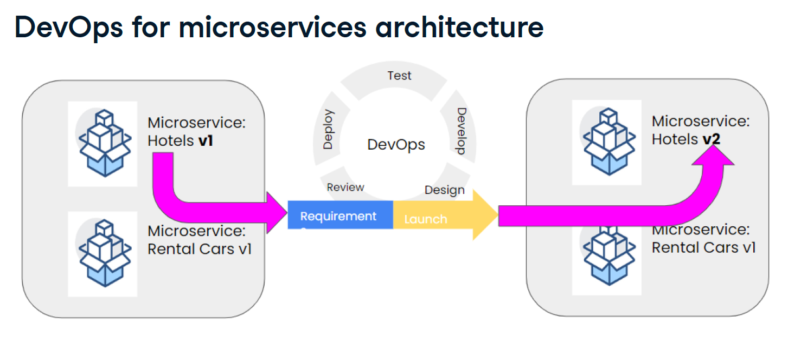

# DevOps
DevOps Concenpts

# DevOps Concepts (Conceitos de DevOps)

## English Version

DevOps is a combination of:

* **Methods:** Refers to the structured approaches and frameworks used in software development and operations.
* **Tools:** Encompasses the various software applications and platforms that automate and facilitate the DevOps processes.
* **Cultural behavior:** Highlights the importance of collaboration, communication, and shared responsibility among development and operations teams.

This integrated approach aims to improve how software is developed and maintained, ultimately helping organizations deliver higher-quality online products faster.

---

## Versão em Português

DevOps é uma combinação de:

* **Métodos:** Refere-se às abordagens estruturadas e frameworks utilizados no desenvolvimento e operações de software.
* **Ferramentas:** Abrange as diversas aplicações e plataformas de software que automatizam e facilitam os processos de DevOps.
* **Comportamento cultural:** Destaca a importância da colaboração, comunicação e responsabilidade compartilhada entre as equipes de desenvolvimento e operações.

Essa abordagem integrada visa melhorar a forma como o software é desenvolvido e mantido, ajudando, em última instância, as organizações a entregar produtos online de maior qualidade mais rapidamente.

# DevOps - True/False Statements (Afirmações Verdadeiras/Falsas)

## English Version

This document summarizes the characteristics of DevOps based on the provided true/false statements.

### True Statements:

* **DevOps helps organize engineering organizations in an improved way.**
    * *Explanation:* DevOps promotes practices that streamline workflows, foster collaboration, and integrate development and operations, leading to more efficient and organized engineering teams.
* **DevOps uses MVPs to increase the pace of innovation.**
    * *Explanation:* Minimum Viable Products (MVPs) are a core concept in agile and DevOps methodologies, allowing teams to quickly validate ideas, gather feedback, and iterate, thereby accelerating the innovation cycle.

### False Statements:

* **DevOps aims to go to the market with a finished product.**
    * *Explanation:* DevOps emphasizes continuous delivery and iterative improvements. The goal is to release frequently and often with smaller, incremental changes, rather than waiting for a "finished" product, which is often a traditional waterfall approach.
* **Traditional change management models suggest an MVP release and product improvements.**
    * *Explanation:* Traditional change management (often associated with waterfall or older methodologies) typically involves extensive planning and large, infrequent releases. The concept of an MVP and continuous, iterative product improvements is characteristic of agile and DevOps methodologies, not traditional models.

---

## Versão em Português

Este documento resume as características de DevOps com base nas afirmações de verdadeiro/falso apresentadas.

### Afirmações Verdadeiras:

* **DevOps ajuda a organizar organizações de engenharia de uma forma melhorada.**
    * *Explicação:* DevOps promove práticas que otimizam fluxos de trabalho, incentivam a colaboração e integram desenvolvimento e operações, resultando em equipes de engenharia mais eficientes e organizadas.
* **DevOps usa MVPs para aumentar o ritmo da inovação.**
    * *Explicação:* Produtos Mínimos Viáveis (MVPs) são um conceito central em metodologias ágeis e DevOps, permitindo que as equipes validem ideias rapidamente, coletem feedback e iterem, acelerando assim o ciclo de inovação.

### Afirmações Falsas:

* **DevOps visa ir para o mercado com um produto acabado.**
    * *Explicação:* DevOps enfatiza a entrega contínua e melhorias iterativas. O objetivo é lançar com frequência e muitas vezes com mudanças menores e incrementais, em vez de esperar por um produto "acabado", que é frequentemente uma abordagem tradicional em cascata (waterfall).
* **Modelos tradicionais de gerenciamento de mudanças sugerem um lançamento de MVP e melhorias de produto.**
    * *Explicação:* O gerenciamento de mudanças tradicional (frequentemente associado a metodologias waterfall ou mais antigas) tipicamente envolve planejamento extenso e lançamentos grandes e infrequentes. O conceito de um MVP e melhorias de produto contínuas e iterativas é característico de metodologias ágeis e DevOps, e não de modelos tradicionais.

# Minimum Viable Product (MVP) - Produto Mínimo Viável

## English Version

### What is an MVP? (As depicted in Release Cycle 1)
* As illustrated, a **Minimum Viable Product (MVP) is an early version of a product with limited functionality.**
* It represents the initial, core iteration released to customers during "Release Cycle 1" to gather essential feedback.
* The focus is on delivering just enough to launch and learn, rather than a fully "finished" product.

### The MVP in the Release Cycle
The image demonstrates how an MVP fits into an iterative development and release flow, often characteristic of DevOps:

* **Requirements & Design:** The cycle begins by defining core requirements and designing the essential functionalities for the MVP.
* **Develop:** The team builds the limited, yet functional, version of the product.
* **Test:** The MVP undergoes testing to ensure its core functionality works as intended.
* **Deploy:** The MVP is released to customers.
* **Review:** After deployment, the team reviews the product's performance and customer engagement.
* **Customers & Feedback:** Crucially, the MVP is put directly in front of customers to elicit immediate reactions and feedback (thumbs up for positive, neutral faces, thumbs down for negative). This feedback loop is vital for subsequent iterations.

### Purpose of Launching an MVP (Connecting to the Cycle)
* **Validate Assumptions:** Quickly test if the limited set of features addresses a real customer need by observing direct customer reactions.
* **Gather Early Feedback:** Obtain real-world insights from users (positive, neutral, negative reactions) immediately after "Launch."
* **Inform Future Iterations:** Use the collected customer feedback to guide subsequent "Design" and "Develop" phases for "Release Cycle 2" and beyond.
* **Reduce Risk:** Avoid extensive development on features that might not resonate with the market, minimizing investment in "Requirements" before validation.

### Key Characteristics of an MVP (Reiterated with Cycle in Mind)
* **Limited Functionality:** Delivers only the absolutely essential features (as part of the first "Develop" cycle).
* **Customer-Centric Feedback:** Designed explicitly to get reactions from "Customers" and drive the "Review" phase.
* **Iterative Base:** Serves as the foundation for future "Develop," "Test," "Deploy" cycles, constantly evolving based on learned insights.
* **Enables Quick Launch:** Facilitates a rapid progression from "Requirements" to "Launch."

### Benefits of This Approach
* **Accelerated Learning:** The direct feedback loop with customers shortens the learning curve significantly.
* **Faster Time to Market:** Enables quick deployment of a viable product, getting value to customers sooner.
* **Risk Mitigation:** Reduces the chance of building a product nobody wants by validating early and often.
* **Continuous Improvement:** The iterative "Develop, Test, Deploy, Review, Design" cycle ensures the product evolves responsively to user needs.

---

## Versão em Português

### O que é um MVP? (Conforme ilustrado no Ciclo de Lançamento 1)
* Conforme ilustrado, um **Produto Mínimo Viável (MVP) é uma versão inicial de um produto com funcionalidade limitada.**
* Ele representa a iteração inicial e central que é lançada para os clientes durante o "Ciclo de Lançamento 1" para coletar feedback essencial.
* O foco é entregar apenas o suficiente para lançar e aprender, em vez de um produto totalmente "acabado".

### O MVP no Ciclo de Lançamento
A imagem demonstra como um MVP se encaixa em um fluxo de desenvolvimento e lançamento iterativo, frequentemente característico do DevOps:

* **Requisitos e Design:** O ciclo começa definindo os requisitos principais e projetando as funcionalidades essenciais para o MVP.
* **Desenvolver (Develop):** A equipe constrói a versão limitada, mas funcional, do produto.
* **Testar (Test):** O MVP passa por testes para garantir que sua funcionalidade principal funcione conforme o esperado.
* **Implantar (Deploy):** O MVP é lançado para os clientes.
* **Revisar (Review):** Após a implantação, a equipe revisa o desempenho do produto e o engajamento do cliente.
* **Clientes e Feedback:** Crucialmente, o MVP é colocado diretamente diante dos clientes para obter reações e feedback imediatos (joinha para positivo, rostos neutros, joinha para baixo para negativo). Este ciclo de feedback é vital para as iterações subsequentes.

### Propósito de Lançar um MVP (Conectando ao Ciclo)
* **Validar Suposições:** Testar rapidamente se o conjunto limitado de funcionalidades aborda uma necessidade real do cliente, observando as reações diretas dos clientes.
* **Coletar Feedback Precoce:** Obter insights do mundo real dos usuários (reações positivas, neutras, negativas) imediatamente após o "Lançamento".
* **Informar Futuras Iterações:** Usar o feedback do cliente coletado para guiar as fases subsequentes de "Design" e "Develop" para o "Ciclo de Lançamento 2" e além.
* **Reduzir Riscos:** Evitar desenvolvimento extensivo em funcionalidades que podem não ressoar com o mercado, minimizando o investimento em "Requisitos" antes da validação.

### Características Chave de um MVP (Reiteradas com o Ciclo em Mente)
* **Funcionalidade Limitada:** Entrega apenas as funcionalidades absolutamente essenciais (como parte do primeiro ciclo de "Desenvolvimento").
* **Feedback Centrado no Cliente:** Projetado explicitamente para obter reações dos "Clientes" e impulsionar a fase de "Revisão".
* **Base Iterativa:** Serve como a base para futuros ciclos de "Desenvolvimento, Teste, Implantação", evoluindo constantemente com base nos aprendizados.
* **Permite Lançamento Rápido:** Facilita uma progressão rápida dos "Requisitos" ao "Lançamento".

### Benefícios Desta Abordagem
* **Aprendizado Acelerado:** O ciclo de feedback direto com os clientes encurta significativamente a curva de aprendizado.
* **Tempo de Lançamento Mais Rápido:** Permite a implantação rápida de um produto viável, entregando valor aos clientes mais cedo.
* **Mitigação de Riscos:** Reduz a chance de construir um produto que ninguém deseja, validando cedo e frequentemente.
* **Melhoria Contínua:** O ciclo iterativo "Desenvolver, Testar, Implantar, Revisar, Design" garante que o produto evolua de forma responsiva às necessidades do usuário.

# Product Improvements through Iterative Release Cycles

This document explains the concept of continuous product improvement driven by customer feedback across iterative release cycles. It highlights how a Minimum Viable Product (MVP) acts as the starting point for this ongoing enhancement process, particularly within a DevOps context.

---

## English Version

### Understanding the Iterative Process: Release Cycle 1 to Release Cycle 2

The image beautifully illustrates a core principle of modern product development and DevOps: **continuous improvement based on validated learning**. It shows how initial product releases (like an MVP) are crucial for gathering real-world feedback that directly influences subsequent development cycles.

#### 1. Release Cycle 1: Launching the Minimum Viable Product (MVP)

* **Requirements & Design:** The journey begins by defining the core problem and designing the essential functionalities for a **Minimum Viable Product (MVP)**.
* **DevOps Loop (Develop, Test, Deploy, Review):** This represents the rapid, iterative cycle where the MVP is built, tested, deployed to users, and its performance is reviewed. This continuous loop is a hallmark of DevOps, aiming for speed and quality.
* **Launch to Customers:** The MVP is launched, directly engaging with real "Customers."
* **Immediate Feedback:** Crucially, customers provide immediate feedback, categorized by their reactions:
    * **Thumbs Up (Positive):** Indicates the MVP is well-received, meeting or exceeding expectations.
    * **Neutral Faces:** Suggests indifference or features that are neither strongly liked nor disliked.
    * **Thumbs Down (Negative):** Highlights dissatisfaction, indicating issues or unmet needs.

#### 2. Driving Product Improvements with Feedback: From Release Cycle 1 to Release Cycle 2

The feedback collected from "Customers" after Release Cycle 1 directly dictates the strategic direction for "Release Cycle 2" and beyond:

* **Scenario A: Positive Feedback (Thumbs Up)**
    * **Action:** The positive reception validates the product's direction.
    * **Outcome:** **"Improve the product"** and **"Invest more resources."** This signifies that the product has found a market fit or delivered significant value, warranting further investment in new features, enhancements, or scaling. The next development cycle focuses on building upon this success.

* **Scenario B: Negative Feedback (Thumbs Down)**
    * **Action:** Negative feedback signals that the MVP did not meet customer expectations or solve their problem effectively.
    * **Outcome:** Two possible paths are indicated:
        * **"Understand the reasons and adapt":** This involves deep analysis of why the product failed (e.g., wrong features, poor usability, unmet need). Based on this understanding, the team can pivot, redesign, or significantly adapt the product's approach for future cycles.
        * **"Drop it without much damage":** If the negative feedback is overwhelming, the core hypothesis is invalidated, or adaptation seems too costly, the team can decide to discontinue the product or feature. This is a crucial benefit of the MVP approach – failing fast and cheaply, minimizing wasted resources.

### Conclusion

This iterative approach, empowered by DevOps principles, ensures that product development is highly responsive to market needs. By continuously launching, gathering feedback, and making data-driven decisions on whether to invest more, adapt, or pivot, organizations can significantly reduce risk and increase their chances of building successful products that truly resonate with customers.

---

## Versão em Português

# Melhorias do Produto Através de Ciclos de Lançamento Iterativos

Este documento explica o conceito de melhoria contínua do produto impulsionada pelo feedback do cliente através de ciclos de lançamento iterativos, Destaca como um Produto Mínimo Viável (MVP) atua como o ponto de partida para este processo contínuo de aprimoramento, especialmente em um contexto DevOps.

---

### Entendendo o Processo Iterativo: Do Ciclo de Lançamento 1 ao Ciclo de Lançamento 2

A imagem ilustra lindamente um princípio central do desenvolvimento moderno de produtos e do DevOps: a **melhoria contínua baseada em aprendizado validado**. Ela mostra como os lançamentos iniciais de produtos (como um MVP) são cruciais para coletar feedback do mundo real que influencia diretamente os ciclos de desenvolvimento subsequentes.

#### 1. Ciclo de Lançamento 1: Lançando o Produto Mínimo Viável (MVP)

* **Requisitos e Design:** A jornada começa definindo o problema central e projetando as funcionalidades essenciais para um **Produto Mínimo Viável (MVP)**.
* **Loop DevOps (Desenvolver, Testar, Implantar, Revisar):** Isso representa o ciclo rápido e iterativo onde o MVP é construído, testado, implantado para os usuários e seu desempenho é revisado. Este loop contínuo é uma marca registrada do DevOps, visando velocidade e qualidade.
* **Lançamento para Clientes:** O MVP é lançado, engajando diretamente com "Clientes" reais.
* **Feedback Imediato:** Crucialmente, os clientes fornecem feedback imediato, categorizado por suas reações:
    * **Joinha para Cima (Positivo):** Indica que o MVP foi bem recebido, atendendo ou superando as expectativas.
    * **Rostos Neutros:** Sugere indiferença ou funcionalidades que não são fortemente gostadas nem desgostadas.
    * **Joinha para Baixo (Negativo):** Destaca insatisfação, indicando problemas ou necessidades não atendidas.

#### 2. Impulsionando as Melhorias do Produto com Feedback: Do Ciclo de Lançamento 1 ao Ciclo de Lançamento 2

O feedback coletado dos "Clientes" após o Ciclo de Lançamento 1 dita diretamente a direção estratégica para o "Ciclo de Lançamento 2" e além:

* **Cenário A: Feedback Positivo (Joinha para Cima)**
    * **Ação:** A recepção positiva valida a direção do produto.
    * **Resultado:** **"Melhorar o produto"** e **"Investir mais recursos."** Isso significa que o produto encontrou um ajuste no mercado ou entregou valor significativo, justificando maior investimento em novas funcionalidades, aprimoramentos ou escalabilidade. O próximo ciclo de desenvolvimento se concentra em construir sobre esse sucesso.

* **Cenário B: Feedback Negativo (Joinha para Baixo)**
    * **Ação:** O feedback negativo indica que o MVP não atendeu às expectativas do cliente ou não resolveu seu problema de forma eficaz.
    * **Resultado:** Dois caminhos possíveis são indicados:
        * **"Entender os motivos e adaptar":** Isso envolve uma análise profunda do motivo pelo qual o produto falhou (por exemplo, funcionalidades erradas, usabilidade ruim, necessidade não atendida). Com base nesse entendimento, a equipe pode pivotar, redesenhar ou adaptar significativamente a abordagem do produto para ciclos futuros.
        * **"Descartar sem muito dano":** Se o feedback negativo for avassalador, a hipótese central for invalidada ou a adaptação parecer muito cara, a equipe pode decidir descontinuar o produto ou a funcionalidade. Este é um benefício crucial da abordagem MVP – falhar rápido e barato, minimizando o desperdício de recursos.

### Conclusão

Essa abordagem iterativa, impulsionada pelos princípios DevOps, garante que o desenvolvimento de produtos seja altamente responsivo às necessidades do mercado. Ao lançar continuamente, coletar feedback e tomar decisões orientadas por dados sobre investir mais, adaptar ou pivotar, as organizações podem reduzir significativamente os riscos e aumentar suas chances de construir produtos de sucesso que realmente ressoam com os clientes.

### Cycle

# Types of Engineering Disciplines (Tipos de Disciplinas de Engenharia)

This document summarizes different engineering disciplines based on the examples provided, showcasing typical tasks associated with each area.

---

## English Version

### 1. Infra Engineering (Engenharia de Infraestrutura)
Focuses on the underlying systems and environments that support applications and services.
* **Cloud Solutions:** Setting up and configuring cloud infrastructure (e.g., AWS, Azure, GCP).
* **Access Management:** Establishing and managing access policies to ensure secure database access only by authorized personnel.

### 2. Product Engineering (Engenharia de Produto)
Concentrates on developing user-facing features and functionalities that constitute a product.
* **Adding Website Functionality:** Implementing features that allow users to directly book hotels via a website.
* **Third-Party Integrations:** Integrating external services (e.g., a car rental agency's webpage) to enable new functionalities within the product.

### 3. Data & ML Engineering (Engenharia de Dados e Machine Learning)
Deals with managing data pipelines, developing machine learning models, and building data-driven intelligent systems.
* **Intelligent Suggestion Systems:** Creating systems that provide personalized suggestions to customers based on their past behavior.
* **Real-time Data Capture:** Capturing and recording user data from a website into a database in real-time for analysis and processing.

---

## Versão em Português

### 1. Infra Engineering (Engenharia de Infraestrutura)
Foca nos sistemas e ambientes subjacentes que dão suporte a aplicações e serviços.
* **Soluções em Nuvem:** Configurar e gerenciar infraestruturas em nuvem (ex: AWS, Azure, GCP).
* **Gerenciamento de Acesso:** Estabelecer e gerenciar políticas de acesso para garantir que apenas pessoal autorizado possa acessar os bancos de dados.

### 2. Product Engineering (Engenharia de Produto)
Concentra-se no desenvolvimento de funcionalidades e recursos voltados para o usuário que compõem um produto.
* **Adicionar Funcionalidades ao Site:** Implementar recursos que permitem aos usuários reservar hotéis diretamente através de um site.
* **Integrações com Terceiros:** Integrar serviços externos (ex: a página de uma agência de aluguel de carros) para habilitar novas funcionalidades dentro do produto.

### 3. Data & ML Engineering (Engenharia de Dados e Machine Learning)
Lida com o gerenciamento de pipelines de dados, desenvolvimento de modelos de machine learning e construção de sistemas inteligentes baseados em dados.
* **Sistemas de Sugestão Inteligentes:** Criar sistemas que fornecem sugestões personalizadas aos clientes com base em seu comportamento passado.
* **Captura de Dados em Tempo Real:** Capturar e registrar dados de usuários de um site em um banco de dados em tempo real para análise e processamento.

# Project Management and DevOps (Gerenciamento de Projetos e DevOps)

This document summarizes the importance of project management within a DevOps context and defines what project management entails.

---

## English Version

### What is Project Management?
Project management is the application of:
* **Specific knowledge:** Expertise in various domains relevant to the project.
* **Skills:** Abilities to lead, communicate, problem-solve, and manage teams.
* **Tools:** Software, frameworks, and methodologies used to plan, execute, and monitor projects.
* **Techniques:** Methods and processes applied to achieve project objectives.

The ultimate goal of project management is to **deliver something of value to people**.

### Why is Project Management Important to DevOps?
Project management plays a crucial role in enabling and enhancing DevOps practices by providing structure and guidance:
* **Defines how the team will operate:** Establishes workflows, roles, responsibilities, and communication channels, ensuring a clear operational model for the team.
* **Drives change:** Facilitates the adoption of new processes, tools, and cultural shifts required for successful DevOps implementation and continuous improvement.
* **Timeline/Resource Management:** Helps in planning and optimizing the allocation of time and resources, ensuring efficient use of personnel, budget, and infrastructure within fast-paced DevOps cycles.
* **Collaboration within/across teams:** Fosters effective communication and synergy between development, operations, and other relevant teams, breaking down silos and promoting shared goals.

---

## Versão em Português

# Gerenciamento de Projetos e DevOps

Este documento resume a importância do gerenciamento de projetos dentro de um contexto DevOps e define o que o gerenciamento de projetos implica.

---

### O que é Gerenciamento de Projetos?
Gerenciamento de projetos é a aplicação de:
* **Conhecimento específico:** Expertise em vários domínios relevantes para o projeto.
* **Habilidades:** Capacidades de liderar, comunicar, resolver problemas e gerenciar equipes.
* **Ferramentas:** Softwares, frameworks e metodologias usadas para planejar, executar e monitorar projetos.
* **Técnicas:** Métodos e processos aplicados para atingir os objetivos do projeto.

O objetivo final do gerenciamento de projetos é **entregar algo de valor às pessoas**.

### Por que o Gerenciamento de Projetos é Importante para DevOps?
O gerenciamento de projetos desempenha um papel crucial ao habilitar e aprimorar as práticas DevOps, fornecendo estrutura e orientação:
* **Define como a equipe irá operar:** Estabelece fluxos de trabalho, papéis, responsabilidades e canais de comunicação, garantindo um modelo operacional claro para a equipe.
* **Impulsiona a mudança:** Facilita a adoção de novos processos, ferramentas e mudanças culturais necessários para uma implementação DevOps bem-sucedida e melhoria contínua.
* **Gerenciamento de Cronogramas/Recursos:** Ajuda no planejamento e otimização da alocação de tempo e recursos, garantindo o uso eficiente de pessoal, orçamento e infraestrutura dentro dos ciclos rápidos de DevOps.
* **Colaboração dentro/entre equipes:** Promove a comunicação eficaz e a sinergia entre as equipes de desenvolvimento, operações e outras equipes relevantes, quebrando silos e promovendo objetivos compartilhados.

# Choosing the Right Project Management Model (Escolhendo o Modelo Certo de Gerenciamento de Projetos)

This document summarizes the key factors to consider when selecting a project management methodology and highlights the prevalent standard in software development.

---

## English Version

### Factors Influencing the Choice of Project Management Methodology

Choosing the most effective project management model is crucial for success and is not a one-size-fits-all decision. The best methodology depends on several critical factors:

* **Team's skill set:** The existing expertise, experience, and familiarity of the team members with different methodologies (e.g., Agile, Waterfall, Scrum, Kanban). A team proficient in agile practices will thrive in such an environment.
* **Budget:** Financial constraints often dictate the feasibility of certain methodologies, as some may require more initial investment in tools, training, or specific roles.
* **Complexity of the project:** Highly complex or rapidly evolving projects often benefit from flexible, iterative approaches, while simpler, well-defined projects might tolerate more traditional models.
* **Expectations:** Stakeholder and client expectations regarding deliverables, timelines, flexibility, and involvement play a significant role in determining the most suitable methodology.

### Agile as the De Facto Standard

For most software development teams today, **Agile is the de facto standard**.
* Agile methodologies (like Scrum and Kanban) emphasize iterative development, flexibility, collaboration, and continuous feedback.
* This approach is particularly well-suited for the dynamic and evolving nature of software projects, allowing teams to adapt to changes quickly and deliver value incrementally.

---

## Versão em Português

# Escolhendo o Modelo Certo de Gerenciamento de Projetos

Este documento resume os fatores chave a serem considerados ao selecionar uma metodologia de gerenciamento de projetos e destaca o padrão predominante no desenvolvimento de software.

---

### Fatores que Influenciam a Escolha da Metodologia de Gerenciamento de Projetos

Escolher o modelo de gerenciamento de projetos mais eficaz é crucial para o sucesso e não é uma decisão única para todas as situações. A melhor metodologia depende de vários fatores críticos:

* **Conjunto de habilidades da equipe:** A expertise, experiência e familiaridade existentes dos membros da equipe com diferentes metodologias (ex: Ágil, Cascata, Scrum, Kanban). Uma equipe proficiente em práticas ágeis prosperará nesse ambiente.
* **Orçamento:** Restrições financeiras frequentemente ditam a viabilidade de certas metodologias, pois algumas podem exigir mais investimento inicial em ferramentas, treinamento ou papéis específicos.
* **Complexidade do projeto:** Projetos altamente complexos ou em rápida evolução geralmente se beneficiam de abordagens flexíveis e iterativas, enquanto projetos mais simples e bem definidos podem tolerar modelos mais tradicionais.
* **Expectativas:** As expectativas das partes interessadas e dos clientes em relação a entregas, prazos, flexibilidade e envolvimento desempenham um papel significativo na determinação da metodologia mais adequada.

### Agile como Padrão de Fato

Para a maioria das equipes de desenvolvimento de software hoje, o **Agile é o padrão de fato**.
* As metodologias ágeis (como Scrum e Kanban) enfatizam o desenvolvimento iterativo, flexibilidade, colaboração e feedback contínuo.
* Essa abordagem é particularmente adequada para a natureza dinâmica e em evolução dos projetos de software, permitindo que as equipes se adaptem às mudanças rapidamente e entreguem valor incrementalmente.

# Project Management Methodologies: True or False (Metodologias de Gerenciamento de Projetos: Verdadeiro ou Falso)

This document explains the validity of various statements regarding popular project management methodologies.

---

## English Version

### True Statements:

1.  **Scrum and Kanban are both great implementations of the Agile philosophy.**
    * **Explanation:** This is **True**. Agile is a mindset defined by values and principles (e.g., from the Agile Manifesto), focusing on iterative development, customer collaboration, and responding to change. Scrum and Kanban are two widely adopted frameworks or methods that operationalize these Agile principles, each with its own practices and strengths.

2.  **Waterfall could be a viable option for small tasks that does not have much complexity.**
    * **Explanation:** This is **True**. While often criticized for its rigidity in complex, evolving projects, the Waterfall model's sequential, linear approach can be perfectly adequate and even efficient for very small, simple, and well-defined tasks or projects where requirements are unlikely to change and risks are minimal.

3.  **Kanban is all about continuous improvement and using visualizations.**
    * **Explanation:** This is **True**. At its core, Kanban focuses on visualizing workflow (e.g., with Kanban boards), limiting Work In Progress (WIP), and continuously improving the flow of value. Its emphasis is on identifying bottlenecks and optimizing the process through incremental changes.

### False Statements:

1.  **Scrum does not define specific roles but ensures collective responsibility.**
    * **Explanation:** This is **False**. Scrum *does* define specific roles: the Product Owner, the Scrum Master, and the Development Team. While Scrum strongly emphasizes collective responsibility for the sprint goal and product outcome, these distinct roles are fundamental to how Scrum teams operate and collaborate.

2.  **Agile is a definitive project management methodology with set practices.**
    * **Explanation:** This is **False**. Agile is not a single, definitive methodology with a rigid set of practices. Instead, Agile is a *philosophy*, a *mindset*, or a *set of principles* (as outlined in the Agile Manifesto). Methodologies like Scrum, Kanban, Lean, Extreme Programming (XP), etc., are specific *frameworks* or *approaches* that implement the Agile philosophy, each with its own defined practices.

---

## Versão em Português

# Metodologias de Gerenciamento de Projetos: Verdadeiro ou Falso

Este documento explica a validade de várias afirmações sobre metodologias populares de gerenciamento de projetos.

---

### Afirmações Verdadeiras:

1.  **Scrum e Kanban são ambas ótimas implementações da filosofia Agile.**
    * **Explicação:** Esta afirmação é **Verdadeira**. Agile é uma mentalidade definida por valores e princípios (ex: do Manifesto Ágil), focando em desenvolvimento iterativo, colaboração com o cliente e resposta a mudanças. Scrum e Kanban são dois frameworks ou métodos amplamente adotados que operacionalizam esses princípios Ágeis, cada um com suas próprias práticas e pontos fortes.

2.  **Waterfall poderia ser uma opção viável para tarefas pequenas que não possuem muita complexidade.**
    * **Explicação:** Esta afirmação é **Verdadeira**. Embora frequentemente criticado por sua rigidez em projetos complexos e em evolução, a abordagem sequencial e linear do modelo Waterfall pode ser perfeitamente adequada e até eficiente para tarefas ou projetos muito pequenos, simples e bem definidos, onde os requisitos são improváveis de mudar e os riscos são mínimos.

3.  **Kanban é sobre melhoria contínua e uso de visualizações.**
    * **Explicação:** Esta afirmação é **Verdadeira**. Em sua essência, o Kanban foca em visualizar o fluxo de trabalho (ex: com quadros Kanban), limitar o Trabalho em Andamento (WIP) e melhorar continuamente o fluxo de valor. Sua ênfase está em identificar gargalos e otimizar o processo por meio de mudanças incrementais.

### Afirmações Falsas:

1.  **Scrum não define papéis específicos, mas garante responsabilidade coletiva.**
    * **Explicação:** Esta afirmação é **Falsa**. O Scrum *define* papéis específicos: o Product Owner (Dono do Produto), o Scrum Master e o Time de Desenvolvimento. Embora o Scrum enfatize fortemente a responsabilidade coletiva pelo objetivo da sprint e pelo resultado do produto, esses papéis distintos são fundamentais para o funcionamento e a colaboração das equipes Scrum.

2.  **Agile é uma metodologia definitiva de gerenciamento de projetos com práticas definidas.**
    * **Explicação:** Esta afirmação é **Falsa**. Agile não é uma metodologia única e definitiva com um conjunto rígido de práticas. Em vez disso, Agile é uma *filosofia*, uma *mentalidade* ou um *conjunto de princípios* (conforme descrito no Manifesto Ágil). Metodologias como Scrum, Kanban, Lean, Extreme Programming (XP), etc., são *frameworks* ou *abordagens* específicas que implementam a filosofia Ágil, cada uma com suas próprias práticas definidas.
  
# Factors in Project Management (Fatores no Gerenciamento de Projetos)

This document outlines some factors that are considered important or unimportant/irrelevant when making decisions in project management.

---

## English Version

When managing projects, understanding which elements truly influence outcomes and which do not is critical. Here are **some factors** categorized by their relevance:

### Important Factors:

These factors significantly impact how a project should be planned, executed, and managed:

* **The complexity of the project:** Highly complex projects often require more flexible methodologies (like Agile), extensive planning, and robust risk management. Simpler projects might allow for more straightforward approaches.
* **The budget of the project:** Financial resources directly dictate the scope, available tools, team size, and even the feasibility of certain approaches. Budget constraints heavily influence decision-making.
* **The size of the team:** Larger teams require more sophisticated communication, coordination, and management structures, while smaller teams might operate more fluidly. Team size impacts resource allocation and methodology choice.

### Unimportant / Irrelevant Factors:

These factors are generally considered not to have a direct or significant impact on the choice of project management approach or the project's success metrics, at least not in the same direct way as the "Important Factors":

* **Using cloud infrastructure:** While *how* infrastructure is used (e.g., specific cloud services, IaC practices) can be part of the project's scope, the mere *fact* of using cloud infrastructure itself does not inherently determine the project management model. It's a technological choice, not a project management influencing factor.
* **The age of the organization:** The number of years an organization has existed typically doesn't directly influence the best project management methodology for a specific project. What matters more are the organization's culture, maturity in adopting new practices, and existing processes, rather than its age.

---

## Versão em Português

# Fatores no Gerenciamento de Projetos

Este documento descreve **alguns fatores** que são considerados importantes ou irrelevantes/sem importância ao tomar decisões no gerenciamento de projetos.

---

### Fatores Importantes:

Esses fatores impactam significativamente como um projeto deve ser planejado, executado e gerenciado:

* **A complexidade do projeto:** Projetos altamente complexos frequentemente exigem metodologias mais flexíveis (como Agile), planejamento extensivo e gerenciamento de riscos robusto. Projetos mais simples podem permitir abordagens mais diretas.
* **O orçamento do projeto:** Os recursos financeiros ditam diretamente o escopo, as ferramentas disponíveis, o tamanho da equipe e até mesmo a viabilidade de certas abordagens. Restrições orçamentárias influenciam fortemente a tomada de decisões.
* **O tamanho da equipe:** Equipes maiores exigem comunicação, coordenação e estruturas de gerenciamento mais sofisticadas, enquanto equipes menores podem operar de forma mais fluida. O tamanho da equipe afeta a alocação de recursos e a escolha da metodologia.

### Fatores Irrelevantes / Sem Importância:

Esses fatores são geralmente considerados como não tendo um impacto direto ou significativo na escolha da abordagem de gerenciamento de projetos ou nas métricas de sucesso do projeto, pelo menos não da mesma forma direta que os "Fatores Importantes":

* **Usando infraestrutura em nuvem:** Embora *como* a infraestrutura é usada (ex: serviços de nuvem específicos, práticas de IaC) possa fazer parte do escopo do projeto, o simples *fato* de usar infraestrutura em nuvem por si só não determina inerentemente o modelo de gerenciamento de projetos. É uma escolha tecnológica, não um fator influenciador do gerenciamento de projetos.
* **A idade da organização:** O número de anos que uma organização existe tipicamente não influencia diretamente a melhor metodologia de gerenciamento de projetos para um projeto específico. O que importa mais são a cultura da organização, a maturidade na adoção de novas práticas e os processos existentes, em vez de sua idade.

# Product Development and Release Cycle (Ciclo de Desenvolvimento e Lançamento de Produto)

This document outlines the sequential steps typically involved in developing and releasing a software product, from initial definition to full public availability, based on the provided items.

---

## English Version

The process of bringing a software product to life involves several key stages, each building upon the previous one. Here are the steps in their correct logical order:

### The Correct Order of Product Development and Release Steps:

1.  **Defining the deliverables and goals related to the product, the software components, their functionality and relation to each other.**
    * **Explanation:** This is the foundational phase. Before any coding begins, it's crucial to clearly define *what* the product will do, *what value* it will deliver, its main objectives, and how its various software parts will interact. This sets the blueprint for the entire project.

2.  **Writing the code for the software components of the product.**
    * **Explanation:** Once the definitions and designs are in place, the development team proceeds with the actual coding. This involves translating the requirements and architectural designs into functional software components.

3.  **Check if the product functions as planned.**
    * **Explanation:** After development, rigorous testing is performed. This step verifies that the software components work correctly, meet the defined requirements, and are free of bugs. Quality assurance is paramount here.

4.  **Review the product one last time before the launch.**
    * **Explanation:** Before any public release, a final comprehensive review is conducted. This involves stakeholders, product owners, and key team members performing a last check to ensure everything is aligned with goals, quality standards, and is ready for users.

5.  **Release the product for a limited set of users.**
    * **Explanation:** This step often represents a Beta release, a controlled rollout, or the launch of a Minimum Viable Product (MVP). The product is made available to a small, specific group of users to gather real-world feedback, identify unforeseen issues, and validate assumptions in a live environment before a broader release.

6.  **Release the product for all of the users.**
    * **Explanation:** Once the product has been validated by the limited user group, necessary adjustments have been made, and confidence in its stability and value is high, it is then fully released to the entire target user base. This is the official public launch.

---

## Versão em Português

# Ciclo de Desenvolvimento e Lançamento de Produto

Este documento descreve os passos sequenciais tipicamente envolvidos no desenvolvimento e lançamento de um produto de software, desde a definição inicial até a disponibilidade pública total, com base nos itens fornecidos.

---

## A Ordem Correta dos Passos de Desenvolvimento e Lançamento de Produto:

1.  **Definir as entregas e metas relacionadas ao produto, os componentes de software, suas funcionalidades e a relação entre eles.**
    * **Explicação:** Esta é a fase fundamental. Antes de qualquer codificação, é crucial definir claramente *o que* o produto fará, *qual valor* ele entregará, seus objetivos principais e como suas várias partes de software interagirão. Isso estabelece o plano para todo o projeto.

2.  **Escrever o código para os componentes de software do produto.**
    * **Explicação:** Uma vez que as definições e designs estejam prontos, a equipe de desenvolvimento prossegue com a codificação real. Isso envolve traduzir os requisitos e designs arquitetônicos em componentes de software funcionais.

3.  **Verificar se o produto funciona conforme o planejado.**
    * **Explicação:** Após o desenvolvimento, testes rigorosos são realizados. Este passo verifica se os componentes de software funcionam corretamente, atendem aos requisitos definidos e estão livres de bugs. A garantia de qualidade é primordial aqui.

4.  **Rever o produto uma última vez antes do lançamento.**
    * **Explicação:** Antes de qualquer lançamento público, uma revisão final abrangente é realizada. Isso envolve stakeholders, donos de produto e membros chave da equipe fazendo uma última verificação para garantir que tudo esteja alinhado com os objetivos, padrões de qualidade e esteja pronto para os usuários.

5.  **Lançar o produto para um conjunto limitado de usuários.**
    * **Explicação:** Este passo frequentemente representa um lançamento Beta, um lançamento controlado ou o lançamento de um Produto Mínimo Viável (MVP). O produto é disponibilizado para um pequeno grupo específico de usuários para coletar feedback do mundo real, identificar problemas imprevistos e validar suposições em um ambiente real antes de um lançamento mais amplo.

6.  **Lançar o produto para todos os usuários.**
    * **Explicação:** Uma vez que o produto foi validado pelo grupo limitado de usuários, os ajustes necessários foram feitos e a confiança em sua estabilidade e valor é alta, ele é então totalmente lançado para toda a base de usuários-alvo. Este é o lançamento público oficial.
  
# Product Development Phases: Design, Development, and Testing

This document outlines key activities within three fundamental phases of product development: Design, Development, and Testing.

---

## English Version

Product development is an iterative process that typically moves through distinct phases, each with specific objectives to ensure a robust and functional outcome.

### 1. Design
This phase focuses on the strategic planning and architectural blueprint of the system, particularly concerning data management.
* **Key Activity:** Working with the product engineering teams to plan how data should flow between systems.
    * **Explanation:** This involves defining data structures, integration points, APIs, and overall data architecture to ensure seamless and efficient communication and transfer of information across different components and systems within the product ecosystem. It's about laying the groundwork before implementation.

### 2. Development
This phase is where the planned designs are translated into functional code and infrastructure.
* **Key Activity:** Implement the data pipelines that allows the data flow between systems.
    * **Explanation:** Based on the design specifications, engineers build and configure the actual mechanisms (e.g., ETL processes, message queues, APIs, databases) that enable data to move, transform, and be stored as intended. This is the creation of the working components.

### 3. Testing
This crucial phase ensures that the developed product functions correctly and meets its intended specifications.
* **Key Activity:** Provide mock data to the product to see if it behaves as planned.
    * **Explanation:** Testers and developers use simulated or dummy data to rigorously evaluate the product's functionality, performance, and reliability. This helps identify bugs, validate data flows, and confirm that the system behaves as expected under various conditions before it's exposed to real user data or production environments.

---

## Versão em Português

# Fases do Desenvolvimento de Produto: Design, Desenvolvimento e Teste

Este documento descreve as atividades chave dentro de três fases fundamentais do desenvolvimento de produto: Design, Desenvolvimento e Teste.

---

## Versão em Português

O desenvolvimento de produtos é um processo iterativo que tipicamente passa por fases distintas, cada uma com objetivos específicos para garantir um resultado robusto e funcional.

### 1. Design
Esta fase foca no planejamento estratégico e no projeto arquitetural do sistema, particularmente no que diz respeito à gestão de dados.
* **Atividade Chave:** Trabalhar com as equipes de engenharia de produto para planejar como os dados devem fluir entre os sistemas.
    * **Explicação:** Isso envolve a definição de estruturas de dados, pontos de integração, APIs e a arquitetura geral de dados para garantir comunicação e transferência de informações contínuas e eficientes entre diferentes componentes e sistemas dentro do ecossistema do produto. É sobre estabelecer as bases antes da implementação.

### 2. Desenvolvimento
Esta fase é onde os designs planejados são traduzidos em código funcional e infraestrutura.
* **Atividade Chave:** Implementar os pipelines de dados que permitem o fluxo de dados entre os sistemas.
    * **Explicação:** Com base nas especificações de design, os engenheiros constroem e configuram os mecanismos reais (ex: processos ETL, filas de mensagens, APIs, bancos de dados) que permitem que os dados se movam, transformem e sejam armazenados conforme o planejado. Esta é a criação dos componentes em funcionamento.

### 3. Teste
Esta fase crucial garante que o produto desenvolvido funcione corretamente e atenda às suas especificações pretendidas.
* **Atividade Chave:** Fornecer dados simulados (mock data) ao produto para ver se ele se comporta conforme o planejado.
    * **Explicação:** Testadores e desenvolvedores usam dados simulados ou fictícios para avaliar rigorosamente a funcionalidade, desempenho e confiabilidade do produto. Isso ajuda a identificar bugs, validar fluxos de dados e confirmar que o sistema se comporta como esperado sob várias condições antes de ser exposto a dados de usuários reais ou ambientes de produção.
 
# Software Architecture Concepts (Conceitos de Arquitetura de Software)

This document provides a concise overview of software architecture, factors influencing architectural decisions, and the role of Application Programming Interfaces (APIs).

---

## English Version

### 1. Software Architecture

**Software architecture refers to the fundamental structures of a software system and the discipline of creating such structures and systems.**
* Each structure comprises software elements, relations among them, and properties of both elements and relations.
    * *Explanation:* This defines the high-level organization of a software system, including its main components, how they interact, and the principles guiding its design and evolution. It's the blueprint for the entire system.

### 2. Various Architectural Systems: Factors to Consider

When designing or evaluating a software architecture, several factors need to be considered to ensure the system is robust, scalable, and meets its requirements:

* **Type of software:** Different software types (e.g., desktop applications, web applications, mobile apps, embedded systems) have distinct architectural needs.
* **In machine or in the browser:** This refers to the deployment environment. Software running directly on a machine (desktop app, server-side) has different architectural considerations than software running within a web browser (front-end web app).
* **Complexity of the software:** The inherent intricacy of the software greatly influences architectural choices. More complex systems typically require more sophisticated architectural patterns.
* **Simpler software parts can be treated as a single unit:** For less complex components or modules, a monolithic approach or treating them as a single, cohesive unit might be efficient.
* **Separate the pieces for more complex software:** For highly complex systems, breaking them down into smaller, independent, and manageable components (e.g., microservices) is often a preferred architectural strategy to reduce complexity and improve maintainability.

### 3. Application Programming Interfaces (APIs)

APIs are fundamental connectors in modern software architecture, enabling different software components or systems to communicate.

* **Data flows through APIs.**
    * *Explanation:* APIs act as intermediaries that define how software components should interact. They specify the methods and data formats that applications can use to request and exchange information, essentially creating a pathway for data to flow between disparate systems.
* **They are essential for software and architecture.**
    * *Explanation:* APIs are crucial for building interconnected and scalable systems. They promote modularity, reusability, and interoperability, allowing developers to build complex applications by integrating various services without needing to understand their internal workings.

---

## Versão em Português

# Conceitos de Arquitetura de Software

Este documento fornece uma visão geral concisa da arquitetura de software, fatores que influenciam as decisões arquiteturais e o papel das Interfaces de Programação de Aplicações (APIs).

---

## Versão em Português

### 1. Arquitetura de Software

**Arquitetura de software refere-se às estruturas fundamentais de um sistema de software e à disciplina de criação de tais estruturas e sistemas.**
* Cada estrutura compreende elementos de software, relações entre eles e propriedades tanto dos elementos quanto das relações.
    * *Explicação:* Isso define a organização de alto nível de um sistema de software, incluindo seus principais componentes, como eles interagem e os princípios que guiam seu design e evolução. É o projeto para todo o sistema.

### 2. Diversos Sistemas Arquiteturais: Fatores a Considerar

Ao projetar ou avaliar uma arquitetura de software, vários fatores precisam ser considerados para garantir que o sistema seja robusto, escalável e atenda aos seus requisitos:

* **Tipo de software:** Diferentes tipos de software (ex: aplicações de desktop, aplicações web, aplicativos móveis, sistemas embarcados) possuem necessidades arquiteturais distintas.
* **Na máquina ou no navegador:** Isso se refere ao ambiente de implantação. Software rodando diretamente em uma máquina (aplicativo de desktop, lado do servidor) tem considerações arquiteturais diferentes do software rodando em um navegador web (aplicativo web front-end).
* **Complexidade do software:** A complexidade inerente do software influencia muito as escolhas arquiteturais. Sistemas mais complexos tipicamente exigem padrões arquiteturais mais sofisticados.
* **Partes de software mais simples podem ser tratadas como uma única unidade:** Para componentes ou módulos menos complexos, uma abordagem monolítica ou tratá-los como uma unidade única e coesa pode ser eficiente.
* **Separar as peças para software mais complexo:** Para sistemas altamente complexos, dividi-los em componentes menores, independentes e gerenciáveis (ex: microsserviços) é frequentemente uma estratégia arquitetural preferida para reduzir a complexidade e melhorar a manutenibilidade.

### 3. Interfaces de Programação de Aplicações (APIs)

APIs são conectores fundamentais na arquitetura de software moderna, permitindo que diferentes componentes ou sistemas de software se comuniquem.

* **Fluxo de dados através de APIs.**
    * *Explicação:* As APIs atuam como intermediários que definem como os componentes de software devem interagir. Elas especificam os métodos e formatos de dados que as aplicações podem usar para solicitar e trocar informações, essencialmente criando um caminho para que os dados fluam entre sistemas díspares.
* **São essenciais para software e arquitetura.**
    * *Explicação:* As APIs são cruciais para a construção de sistemas interconectados e escaláveis. Elas promovem modularidade, reusabilidade e interoperabilidade, permitindo que os desenvolvedores construam aplicações complexas integrando vários serviços sem a necessidade de entender seu funcionamento interno.

# Microservices and DevOps Architecture (Microsserviços e Arquitetura DevOps)

This document explains what microservices are, their key characteristics, and how the DevOps methodology is applied to their development and deployment.

---

## English Version

### 1. Microservices

Microservices represent a modern architectural approach, especially relevant for complex software systems.

* **Most important architectural system for complex software.**
    * *Explanation:* This approach is highly favored for large, intricate applications because it allows for greater modularity, scalability, and flexibility compared to traditional monolithic architectures.
* **Common in modern organizations.**
    * *Explanation:* Many contemporary companies, particularly those focused on rapid innovation and continuous delivery, have adopted microservices due to their inherent advantages in agility and resilience.
* **Rather than a big single unit, have many smaller independent units.**
    * *Explanation:* This is the defining characteristic. Instead of building one large, tightly coupled application, a microservices architecture breaks down the application into a collection of small, autonomous services.
* **Smaller units are called the microservices.**
    * *Explanation:* Each of these independent, small units is a "microservice," typically responsible for a specific business capability.
* **They communicate to each other via APIs.**
    * *Explanation:* Since microservices are independent, they rely on well-defined Application Programming Interfaces (APIs) to interact and exchange data, ensuring loose coupling and clear contracts between services.

### 2. DevOps for Microservices Architecture

DevOps principles are intrinsically linked with the successful implementation and management of microservices, facilitating their iterative development and deployment.

The image illustrates how individual microservices, like "Microservice: Hotels" or "Microservice: Rental Cars," evolve through a continuous DevOps cycle:

* **Iterative Development:** Each microservice can be developed, tested, and deployed independently. For instance, "Microservice: Hotels v1" can be updated to "Microservice: Hotels v2" without affecting other services like "Microservice: Rental Cars v1."
* **DevOps Cycle:** Changes to a microservice go through a full **DevOps** cycle, which includes:
    * **Develop:** Coding and building the service.
    * **Test:** Verifying the service's functionality and performance.
    * **Deploy:** Releasing the updated service to an environment.
    * **Review:** Evaluating the service's performance and impact.
    * **Design:** Planning future enhancements or adaptations based on feedback and new requirements.
* **Requirements and Launch:** This cycle is driven by new "Requirement" and culminates in a "Launch," allowing for rapid iteration and deployment of updates to specific services without needing to re-release the entire application.

This synergy between DevOps and microservices allows organizations to achieve faster release cycles, greater operational efficiency, and more resilient systems by managing smaller, more manageable units.

---

## Versão em Português

# Microsserviços e Arquitetura DevOps

Este documento explica o que são microsserviços, suas características chave e como a metodologia DevOps é aplicada ao seu desenvolvimento e implantação.

---

## Versão em Português

### 1. Microsserviços

Microsserviços representam uma abordagem arquitetural moderna, especialmente relevante para sistemas de software complexos.

* **Sistema arquitetural mais importante para software complexo.**
    * *Explicação:* Essa abordagem é altamente favorecida para aplicações grandes e intrincadas porque permite maior modularidade, escalabilidade e flexibilidade em comparação com as arquiteturas monolíticas tradicionais.
* **Comum em organizações modernas.**
    * *Explicação:* Muitas empresas contemporâneas, particularmente aquelas focadas em inovação rápida e entrega contínua, adotaram microsserviços devido às suas vantagens inerentes em agilidade e resiliência.
* **Em vez de uma grande unidade única, possui muitas unidades menores independentes.**
    * *Explicação:* Esta é a característica definidora. Em vez de construir uma única aplicação grande e fortemente acoplada, uma arquitetura de microsserviços divide a aplicação em uma coleção de serviços pequenos e autônomos.
* **Unidades menores são chamadas de microsserviços.**
    * *Explicação:* Cada uma dessas unidades pequenas e independentes é um "microsserviço", tipicamente responsável por uma capacidade de negócio específica.
* **Eles se comunicam entre si via APIs.**
    * *Explicação:* Como os microsserviços são independentes, eles dependem de Interfaces de Programação de Aplicações (APIs) bem definidas para interagir e trocar dados, garantindo acoplamento frouxo e contratos claros entre os serviços.

### 2. DevOps para Arquitetura de Microsserviços

Os princípios DevOps estão intrinsecamente ligados à implementação e gerenciamento bem-sucedidos de microsserviços, facilitando seu desenvolvimento e implantação iterativos.

A imagem ilustra como microsserviços individuais, como "Microsserviço: Hotéis" ou "Microsserviço: Aluguel de Carros", evoluem através de um ciclo DevOps contínuo:

* **Desenvolvimento Iterativo:** Cada microsserviço pode ser desenvolvido, testado e implantado de forma independente. Por exemplo, "Microsserviço: Hotéis v1" pode ser atualizado para "Microsserviço: Hotéis v2" sem afetar outros serviços como "Microsserviço: Aluguel de Carros v1".
* **Ciclo DevOps:** As mudanças em um microsserviço passam por um ciclo **DevOps** completo, que inclui:
    * **Desenvolver (Develop):** Codificação e construção do serviço.
    * **Testar (Test):** Verificação da funcionalidade e desempenho do serviço.
    * **Implantar (Deploy):** Lançamento do serviço atualizado para um ambiente.
    * **Revisar (Review):** Avaliação do desempenho e impacto do serviço.
    * **Design:** Planejamento de futuras melhorias ou adaptações com base em feedback e novos requisitos.
* **Requisitos e Lançamento:** Este ciclo é impulsionado por um novo "Requisito" e culmina em um "Lançamento", permitindo iteração rápida e implantação de atualizações para serviços específicos sem a necessidade de relançar a aplicação inteira.

Essa sinergia entre DevOps e microsserviços permite que as organizações alcancem ciclos de lançamento mais rápidos, maior eficiência operacional e sistemas mais resilientes, gerenciando unidades menores e mais gerenciáveis.

