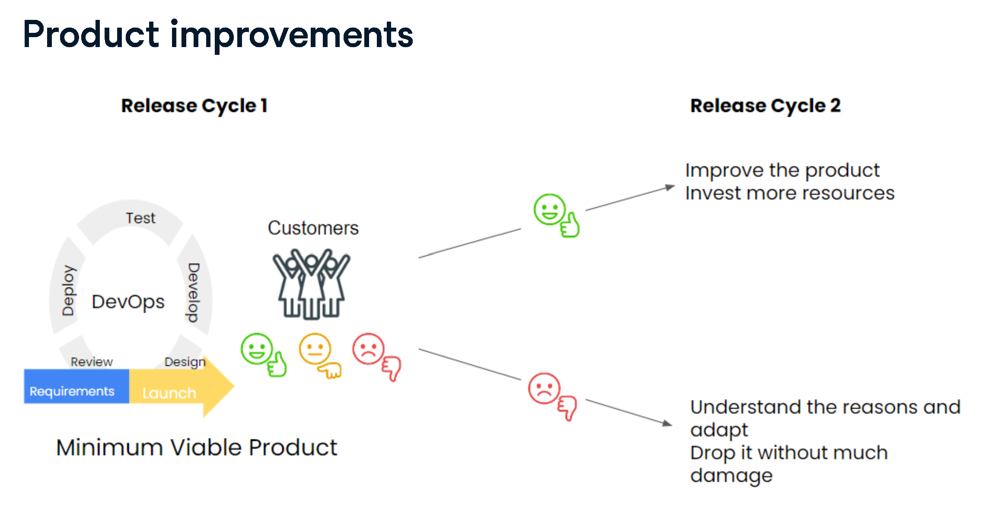
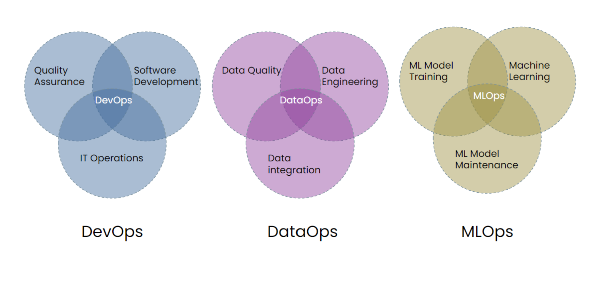

# DevOps
DevOps Concenpts

# DevOps Concepts (Conceitos de DevOps)

## English Version

DevOps is a combination of:

* **Methods:** Refers to the structured approaches and frameworks used in software development and operations.
* **Tools:** Encompasses the various software applications and platforms that automate and facilitate the DevOps processes.
* **Cultural behavior:** Highlights the importance of collaboration, communication, and shared responsibility among development and operations teams.

This integrated approach aims to improve how software is developed and maintained, ultimately helping organizations deliver higher-quality online products faster.

---

## Versão em Português

DevOps é uma combinação de:

* **Métodos:** Refere-se às abordagens estruturadas e frameworks utilizados no desenvolvimento e operações de software.
* **Ferramentas:** Abrange as diversas aplicações e plataformas de software que automatizam e facilitam os processos de DevOps.
* **Comportamento cultural:** Destaca a importância da colaboração, comunicação e responsabilidade compartilhada entre as equipes de desenvolvimento e operações.

Essa abordagem integrada visa melhorar a forma como o software é desenvolvido e mantido, ajudando, em última instância, as organizações a entregar produtos online de maior qualidade mais rapidamente.

# DevOps - True/False Statements (Afirmações Verdadeiras/Falsas)

## English Version

This document summarizes the characteristics of DevOps based on the provided true/false statements.

### True Statements:

* **DevOps helps organize engineering organizations in an improved way.**
    * *Explanation:* DevOps promotes practices that streamline workflows, foster collaboration, and integrate development and operations, leading to more efficient and organized engineering teams.
* **DevOps uses MVPs to increase the pace of innovation.**
    * *Explanation:* Minimum Viable Products (MVPs) are a core concept in agile and DevOps methodologies, allowing teams to quickly validate ideas, gather feedback, and iterate, thereby accelerating the innovation cycle.

### False Statements:

* **DevOps aims to go to the market with a finished product.**
    * *Explanation:* DevOps emphasizes continuous delivery and iterative improvements. The goal is to release frequently and often with smaller, incremental changes, rather than waiting for a "finished" product, which is often a traditional waterfall approach.
* **Traditional change management models suggest an MVP release and product improvements.**
    * *Explanation:* Traditional change management (often associated with waterfall or older methodologies) typically involves extensive planning and large, infrequent releases. The concept of an MVP and continuous, iterative product improvements is characteristic of agile and DevOps methodologies, not traditional models.

---

## Versão em Português

Este documento resume as características de DevOps com base nas afirmações de verdadeiro/falso apresentadas.

### Afirmações Verdadeiras:

* **DevOps ajuda a organizar organizações de engenharia de uma forma melhorada.**
    * *Explicação:* DevOps promove práticas que otimizam fluxos de trabalho, incentivam a colaboração e integram desenvolvimento e operações, resultando em equipes de engenharia mais eficientes e organizadas.
* **DevOps usa MVPs para aumentar o ritmo da inovação.**
    * *Explicação:* Produtos Mínimos Viáveis (MVPs) são um conceito central em metodologias ágeis e DevOps, permitindo que as equipes validem ideias rapidamente, coletem feedback e iterem, acelerando assim o ciclo de inovação.

### Afirmações Falsas:

* **DevOps visa ir para o mercado com um produto acabado.**
    * *Explicação:* DevOps enfatiza a entrega contínua e melhorias iterativas. O objetivo é lançar com frequência e muitas vezes com mudanças menores e incrementais, em vez de esperar por um produto "acabado", que é frequentemente uma abordagem tradicional em cascata (waterfall).
* **Modelos tradicionais de gerenciamento de mudanças sugerem um lançamento de MVP e melhorias de produto.**
    * *Explicação:* O gerenciamento de mudanças tradicional (frequentemente associado a metodologias waterfall ou mais antigas) tipicamente envolve planejamento extenso e lançamentos grandes e infrequentes. O conceito de um MVP e melhorias de produto contínuas e iterativas é característico de metodologias ágeis e DevOps, e não de modelos tradicionais.

# Minimum Viable Product (MVP) - Produto Mínimo Viável

## English Version

### What is an MVP? (As depicted in Release Cycle 1)
* As illustrated, a **Minimum Viable Product (MVP) is an early version of a product with limited functionality.**
* It represents the initial, core iteration released to customers during "Release Cycle 1" to gather essential feedback.
* The focus is on delivering just enough to launch and learn, rather than a fully "finished" product.

### The MVP in the Release Cycle
The image demonstrates how an MVP fits into an iterative development and release flow, often characteristic of DevOps:

* **Requirements & Design:** The cycle begins by defining core requirements and designing the essential functionalities for the MVP.
* **Develop:** The team builds the limited, yet functional, version of the product.
* **Test:** The MVP undergoes testing to ensure its core functionality works as intended.
* **Deploy:** The MVP is released to customers.
* **Review:** After deployment, the team reviews the product's performance and customer engagement.
* **Customers & Feedback:** Crucially, the MVP is put directly in front of customers to elicit immediate reactions and feedback (thumbs up for positive, neutral faces, thumbs down for negative). This feedback loop is vital for subsequent iterations.

### Purpose of Launching an MVP (Connecting to the Cycle)
* **Validate Assumptions:** Quickly test if the limited set of features addresses a real customer need by observing direct customer reactions.
* **Gather Early Feedback:** Obtain real-world insights from users (positive, neutral, negative reactions) immediately after "Launch."
* **Inform Future Iterations:** Use the collected customer feedback to guide subsequent "Design" and "Develop" phases for "Release Cycle 2" and beyond.
* **Reduce Risk:** Avoid extensive development on features that might not resonate with the market, minimizing investment in "Requirements" before validation.

### Key Characteristics of an MVP (Reiterated with Cycle in Mind)
* **Limited Functionality:** Delivers only the absolutely essential features (as part of the first "Develop" cycle).
* **Customer-Centric Feedback:** Designed explicitly to get reactions from "Customers" and drive the "Review" phase.
* **Iterative Base:** Serves as the foundation for future "Develop," "Test," "Deploy" cycles, constantly evolving based on learned insights.
* **Enables Quick Launch:** Facilitates a rapid progression from "Requirements" to "Launch."

### Benefits of This Approach
* **Accelerated Learning:** The direct feedback loop with customers shortens the learning curve significantly.
* **Faster Time to Market:** Enables quick deployment of a viable product, getting value to customers sooner.
* **Risk Mitigation:** Reduces the chance of building a product nobody wants by validating early and often.
* **Continuous Improvement:** The iterative "Develop, Test, Deploy, Review, Design" cycle ensures the product evolves responsively to user needs.

---

## Versão em Português

### O que é um MVP? (Conforme ilustrado no Ciclo de Lançamento 1)
* Conforme ilustrado, um **Produto Mínimo Viável (MVP) é uma versão inicial de um produto com funcionalidade limitada.**
* Ele representa a iteração inicial e central que é lançada para os clientes durante o "Ciclo de Lançamento 1" para coletar feedback essencial.
* O foco é entregar apenas o suficiente para lançar e aprender, em vez de um produto totalmente "acabado".

### O MVP no Ciclo de Lançamento
A imagem demonstra como um MVP se encaixa em um fluxo de desenvolvimento e lançamento iterativo, frequentemente característico do DevOps:

* **Requisitos e Design:** O ciclo começa definindo os requisitos principais e projetando as funcionalidades essenciais para o MVP.
* **Desenvolver (Develop):** A equipe constrói a versão limitada, mas funcional, do produto.
* **Testar (Test):** O MVP passa por testes para garantir que sua funcionalidade principal funcione conforme o esperado.
* **Implantar (Deploy):** O MVP é lançado para os clientes.
* **Revisar (Review):** Após a implantação, a equipe revisa o desempenho do produto e o engajamento do cliente.
* **Clientes e Feedback:** Crucialmente, o MVP é colocado diretamente diante dos clientes para obter reações e feedback imediatos (joinha para positivo, rostos neutros, joinha para baixo para negativo). Este ciclo de feedback é vital para as iterações subsequentes.

### Propósito de Lançar um MVP (Conectando ao Ciclo)
* **Validar Suposições:** Testar rapidamente se o conjunto limitado de funcionalidades aborda uma necessidade real do cliente, observando as reações diretas dos clientes.
* **Coletar Feedback Precoce:** Obter insights do mundo real dos usuários (reações positivas, neutras, negativas) imediatamente após o "Lançamento".
* **Informar Futuras Iterações:** Usar o feedback do cliente coletado para guiar as fases subsequentes de "Design" e "Develop" para o "Ciclo de Lançamento 2" e além.
* **Reduzir Riscos:** Evitar desenvolvimento extensivo em funcionalidades que podem não ressoar com o mercado, minimizando o investimento em "Requisitos" antes da validação.

### Características Chave de um MVP (Reiteradas com o Ciclo em Mente)
* **Funcionalidade Limitada:** Entrega apenas as funcionalidades absolutamente essenciais (como parte do primeiro ciclo de "Desenvolvimento").
* **Feedback Centrado no Cliente:** Projetado explicitamente para obter reações dos "Clientes" e impulsionar a fase de "Revisão".
* **Base Iterativa:** Serve como a base para futuros ciclos de "Desenvolvimento, Teste, Implantação", evoluindo constantemente com base nos aprendizados.
* **Permite Lançamento Rápido:** Facilita uma progressão rápida dos "Requisitos" ao "Lançamento".

### Benefícios Desta Abordagem
* **Aprendizado Acelerado:** O ciclo de feedback direto com os clientes encurta significativamente a curva de aprendizado.
* **Tempo de Lançamento Mais Rápido:** Permite a implantação rápida de um produto viável, entregando valor aos clientes mais cedo.
* **Mitigação de Riscos:** Reduz a chance de construir um produto que ninguém deseja, validando cedo e frequentemente.
* **Melhoria Contínua:** O ciclo iterativo "Desenvolver, Testar, Implantar, Revisar, Design" garante que o produto evolua de forma responsiva às necessidades do usuário.

# Product Improvements through Iterative Release Cycles

This document explains the concept of continuous product improvement driven by customer feedback across iterative release cycles, as illustrated in the provided image. It highlights how a Minimum Viable Product (MVP) acts as the starting point for this ongoing enhancement process, particularly within a DevOps context.

---

## English Version

### Understanding the Iterative Process: Release Cycle 1 to Release Cycle 2

The image beautifully illustrates a core principle of modern product development and DevOps: **continuous improvement based on validated learning**. It shows how initial product releases (like an MVP) are crucial for gathering real-world feedback that directly influences subsequent development cycles.

#### 1. Release Cycle 1: Launching the Minimum Viable Product (MVP)

* **Requirements & Design:** The journey begins by defining the core problem and designing the essential functionalities for a **Minimum Viable Product (MVP)**.
* **DevOps Loop (Develop, Test, Deploy, Review):** This represents the rapid, iterative cycle where the MVP is built, tested, deployed to users, and its performance is reviewed. This continuous loop is a hallmark of DevOps, aiming for speed and quality.
* **Launch to Customers:** The MVP is launched, directly engaging with real "Customers."
* **Immediate Feedback:** Crucially, customers provide immediate feedback, categorized by their reactions:
    * **Thumbs Up (Positive):** Indicates the MVP is well-received, meeting or exceeding expectations.
    * **Neutral Faces:** Suggests indifference or features that are neither strongly liked nor disliked.
    * **Thumbs Down (Negative):** Highlights dissatisfaction, indicating issues or unmet needs.

#### 2. Driving Product Improvements with Feedback: From Release Cycle 1 to Release Cycle 2

The feedback collected from "Customers" after Release Cycle 1 directly dictates the strategic direction for "Release Cycle 2" and beyond:

* **Scenario A: Positive Feedback (Thumbs Up)**
    * **Action:** The positive reception validates the product's direction.
    * **Outcome:** **"Improve the product"** and **"Invest more resources."** This signifies that the product has found a market fit or delivered significant value, warranting further investment in new features, enhancements, or scaling. The next development cycle focuses on building upon this success.

* **Scenario B: Negative Feedback (Thumbs Down)**
    * **Action:** Negative feedback signals that the MVP did not meet customer expectations or solve their problem effectively.
    * **Outcome:** Two possible paths are indicated:
        * **"Understand the reasons and adapt":** This involves deep analysis of why the product failed (e.g., wrong features, poor usability, unmet need). Based on this understanding, the team can pivot, redesign, or significantly adapt the product's approach for future cycles.
        * **"Drop it without much damage":** If the negative feedback is overwhelming, the core hypothesis is invalidated, or adaptation seems too costly, the team can decide to discontinue the product or feature. This is a crucial benefit of the MVP approach – failing fast and cheaply, minimizing wasted resources.

### Conclusion

This iterative approach, empowered by DevOps principles, ensures that product development is highly responsive to market needs. By continuously launching, gathering feedback, and making data-driven decisions on whether to invest more, adapt, or pivot, organizations can significantly reduce risk and increase their chances of building successful products that truly resonate with customers.

---

## Versão em Português

# Melhorias do Produto Através de Ciclos de Lançamento Iterativos

Este documento explica o conceito de melhoria contínua do produto impulsionada pelo feedback do cliente através de ciclos de lançamento iterativos, conforme ilustrado na imagem fornecida. Ele destaca como um Produto Mínimo Viável (MVP) atua como o ponto de partida para este processo contínuo de aprimoramento, especialmente em um contexto DevOps.

---

### Entendendo o Processo Iterativo: Do Ciclo de Lançamento 1 ao Ciclo de Lançamento 2

A imagem ilustra lindamente um princípio central do desenvolvimento moderno de produtos e do DevOps: a **melhoria contínua baseada em aprendizado validado**. Ela mostra como os lançamentos iniciais de produtos (como um MVP) são cruciais para coletar feedback do mundo real que influencia diretamente os ciclos de desenvolvimento subsequentes.

#### 1. Ciclo de Lançamento 1: Lançando o Produto Mínimo Viável (MVP)

* **Requisitos e Design:** A jornada começa definindo o problema central e projetando as funcionalidades essenciais para um **Produto Mínimo Viável (MVP)**.
* **Loop DevOps (Desenvolver, Testar, Implantar, Revisar):** Isso representa o ciclo rápido e iterativo onde o MVP é construído, testado, implantado para os usuários e seu desempenho é revisado. Este loop contínuo é uma marca registrada do DevOps, visando velocidade e qualidade.
* **Lançamento para Clientes:** O MVP é lançado, engajando diretamente com "Clientes" reais.
* **Feedback Imediato:** Crucialmente, os clientes fornecem feedback imediato, categorizado por suas reações:
    * **Joinha para Cima (Positivo):** Indica que o MVP foi bem recebido, atendendo ou superando as expectativas.
    * **Rostos Neutros:** Sugere indiferença ou funcionalidades que não são fortemente gostadas nem desgostadas.
    * **Joinha para Baixo (Negativo):** Destaca insatisfação, indicando problemas ou necessidades não atendidas.

#### 2. Impulsionando as Melhorias do Produto com Feedback: Do Ciclo de Lançamento 1 ao Ciclo de Lançamento 2

O feedback coletado dos "Clientes" após o Ciclo de Lançamento 1 dita diretamente a direção estratégica para o "Ciclo de Lançamento 2" e além:

* **Cenário A: Feedback Positivo (Joinha para Cima)**
    * **Ação:** A recepção positiva valida a direção do produto.
    * **Resultado:** **"Melhorar o produto"** e **"Investir mais recursos."** Isso significa que o produto encontrou um ajuste no mercado ou entregou valor significativo, justificando maior investimento em novas funcionalidades, aprimoramentos ou escalabilidade. O próximo ciclo de desenvolvimento se concentra em construir sobre esse sucesso.

* **Cenário B: Feedback Negativo (Joinha para Baixo)**
    * **Ação:** O feedback negativo indica que o MVP não atendeu às expectativas do cliente ou não resolveu seu problema de forma eficaz.
    * **Resultado:** Dois caminhos possíveis são indicados:
        * **"Entender os motivos e adaptar":** Isso envolve uma análise profunda do motivo pelo qual o produto falhou (por exemplo, funcionalidades erradas, usabilidade ruim, necessidade não atendida). Com base nesse entendimento, a equipe pode pivotar, redesenhar ou adaptar significativamente a abordagem do produto para ciclos futuros.
        * **"Descartar sem muito dano":** Se o feedback negativo for avassalador, a hipótese central for invalidada ou a adaptação parecer muito cara, a equipe pode decidir descontinuar o produto ou a funcionalidade. Este é um benefício crucial da abordagem MVP – falhar rápido e barato, minimizando o desperdício de recursos.

### Conclusão

Essa abordagem iterativa, impulsionada pelos princípios DevOps, garante que o desenvolvimento de produtos seja altamente responsivo às necessidades do mercado. Ao lançar continuamente, coletar feedback e tomar decisões orientadas por dados sobre investir mais, adaptar ou pivotar, as organizações podem reduzir significativamente os riscos e aumentar suas chances de construir produtos de sucesso que realmente ressoam com os clientes.

### Cycle

# Types of Engineering Disciplines (Tipos de Disciplinas de Engenharia)

This document summarizes different engineering disciplines based on the examples provided, showcasing typical tasks associated with each area.

---

## English Version

### 1. Infra Engineering (Engenharia de Infraestrutura)
Focuses on the underlying systems and environments that support applications and services.
* **Cloud Solutions:** Setting up and configuring cloud infrastructure (e.g., AWS, Azure, GCP).
* **Access Management:** Establishing and managing access policies to ensure secure database access only by authorized personnel.

### 2. Product Engineering (Engenharia de Produto)
Concentrates on developing user-facing features and functionalities that constitute a product.
* **Adding Website Functionality:** Implementing features that allow users to directly book hotels via a website.
* **Third-Party Integrations:** Integrating external services (e.g., a car rental agency's webpage) to enable new functionalities within the product.

### 3. Data & ML Engineering (Engenharia de Dados e Machine Learning)
Deals with managing data pipelines, developing machine learning models, and building data-driven intelligent systems.
* **Intelligent Suggestion Systems:** Creating systems that provide personalized suggestions to customers based on their past behavior.
* **Real-time Data Capture:** Capturing and recording user data from a website into a database in real-time for analysis and processing.

---

## Versão em Português

### 1. Infra Engineering (Engenharia de Infraestrutura)
Foca nos sistemas e ambientes subjacentes que dão suporte a aplicações e serviços.
* **Soluções em Nuvem:** Configurar e gerenciar infraestruturas em nuvem (ex: AWS, Azure, GCP).
* **Gerenciamento de Acesso:** Estabelecer e gerenciar políticas de acesso para garantir que apenas pessoal autorizado possa acessar os bancos de dados.

### 2. Product Engineering (Engenharia de Produto)
Concentra-se no desenvolvimento de funcionalidades e recursos voltados para o usuário que compõem um produto.
* **Adicionar Funcionalidades ao Site:** Implementar recursos que permitem aos usuários reservar hotéis diretamente através de um site.
* **Integrações com Terceiros:** Integrar serviços externos (ex: a página de uma agência de aluguel de carros) para habilitar novas funcionalidades dentro do produto.

### 3. Data & ML Engineering (Engenharia de Dados e Machine Learning)
Lida com o gerenciamento de pipelines de dados, desenvolvimento de modelos de machine learning e construção de sistemas inteligentes baseados em dados.
* **Sistemas de Sugestão Inteligentes:** Criar sistemas que fornecem sugestões personalizadas aos clientes com base em seu comportamento passado.
* **Captura de Dados em Tempo Real:** Capturar e registrar dados de usuários de um site em um banco de dados em tempo real para análise e processamento.

# Project Management and DevOps (Gerenciamento de Projetos e DevOps)

This document summarizes the importance of project management within a DevOps context and defines what project management entails, based on the provided image.

---

## English Version

### What is Project Management?
Project management is the application of:
* **Specific knowledge:** Expertise in various domains relevant to the project.
* **Skills:** Abilities to lead, communicate, problem-solve, and manage teams.
* **Tools:** Software, frameworks, and methodologies used to plan, execute, and monitor projects.
* **Techniques:** Methods and processes applied to achieve project objectives.

The ultimate goal of project management is to **deliver something of value to people**.

### Why is Project Management Important to DevOps?
Project management plays a crucial role in enabling and enhancing DevOps practices by providing structure and guidance:
* **Defines how the team will operate:** Establishes workflows, roles, responsibilities, and communication channels, ensuring a clear operational model for the team.
* **Drives change:** Facilitates the adoption of new processes, tools, and cultural shifts required for successful DevOps implementation and continuous improvement.
* **Timeline/Resource Management:** Helps in planning and optimizing the allocation of time and resources, ensuring efficient use of personnel, budget, and infrastructure within fast-paced DevOps cycles.
* **Collaboration within/across teams:** Fosters effective communication and synergy between development, operations, and other relevant teams, breaking down silos and promoting shared goals.

---

## Versão em Português

# Gerenciamento de Projetos e DevOps

Este documento resume a importância do gerenciamento de projetos dentro de um contexto DevOps e define o que o gerenciamento de projetos implica, com base na imagem fornecida.

---

### O que é Gerenciamento de Projetos?
Gerenciamento de projetos é a aplicação de:
* **Conhecimento específico:** Expertise em vários domínios relevantes para o projeto.
* **Habilidades:** Capacidades de liderar, comunicar, resolver problemas e gerenciar equipes.
* **Ferramentas:** Softwares, frameworks e metodologias usadas para planejar, executar e monitorar projetos.
* **Técnicas:** Métodos e processos aplicados para atingir os objetivos do projeto.

O objetivo final do gerenciamento de projetos é **entregar algo de valor às pessoas**.

### Por que o Gerenciamento de Projetos é Importante para DevOps?
O gerenciamento de projetos desempenha um papel crucial ao habilitar e aprimorar as práticas DevOps, fornecendo estrutura e orientação:
* **Define como a equipe irá operar:** Estabelece fluxos de trabalho, papéis, responsabilidades e canais de comunicação, garantindo um modelo operacional claro para a equipe.
* **Impulsiona a mudança:** Facilita a adoção de novos processos, ferramentas e mudanças culturais necessários para uma implementação DevOps bem-sucedida e melhoria contínua.
* **Gerenciamento de Cronogramas/Recursos:** Ajuda no planejamento e otimização da alocação de tempo e recursos, garantindo o uso eficiente de pessoal, orçamento e infraestrutura dentro dos ciclos rápidos de DevOps.
* **Colaboração dentro/entre equipes:** Promove a comunicação eficaz e a sinergia entre as equipes de desenvolvimento, operações e outras equipes relevantes, quebrando silos e promovendo objetivos compartilhados.
